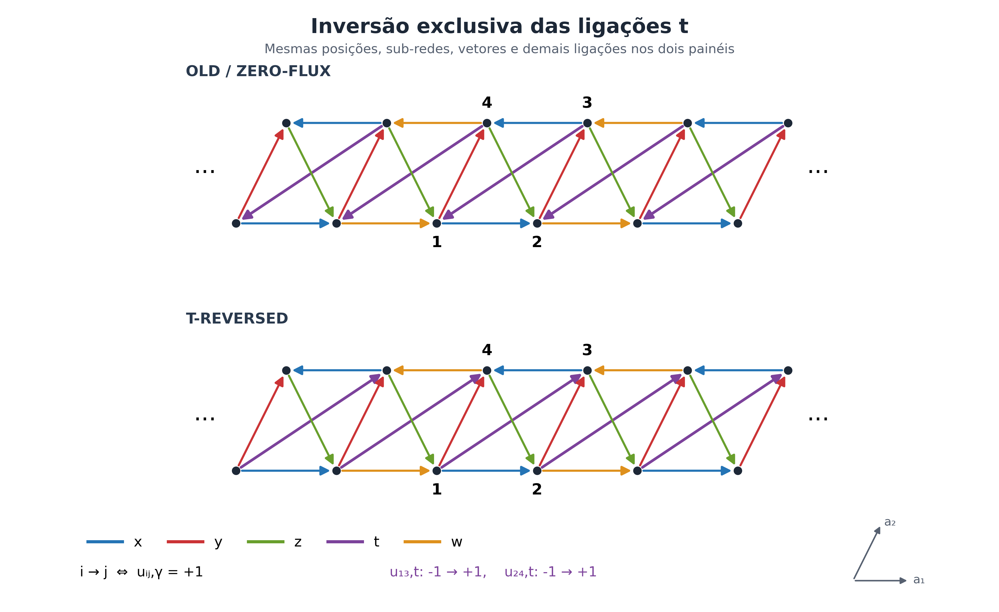
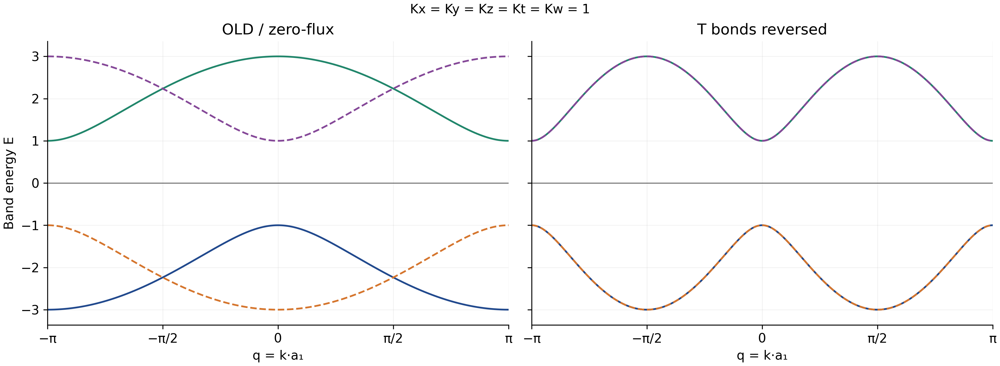
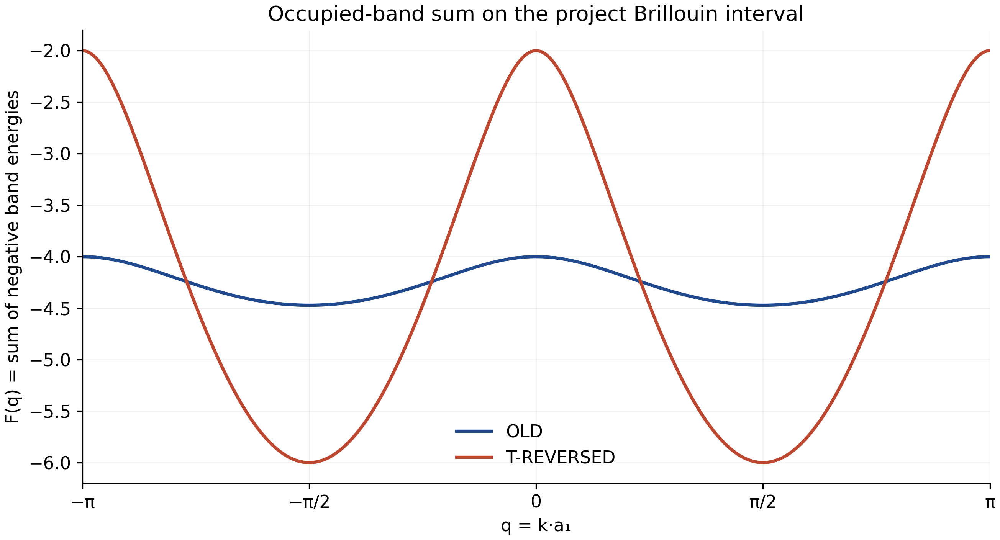

# Quadrupolar Spin Liquid in 1D — T-Reversed Gauge

Auditoria física, matemática e computacional do setor construído a partir do
OLD, invertendo exclusivamente a família t. Resultado principal no ponto
isotrópico $K_x=K_y=K_z=K_t=K_w=1$. Acoplamentos reais assimétricos, incluindo
sinais mistos, são usados para testar a implementação geral.

**Intervalo principal: $q\in[-\pi,\pi]$; quatro sítios por célula.**

[RESULTADO SIMBÓLICO] OLD e T têm a mesma energia de matéria por sítio no limite
termodinâmico isotrópico, embora seus fluxos e suas dispersões em um mesmo
momento sejam diferentes. A igualdade energética é demonstrada na seção 21.
Os resultados numéricos, seus erros e sua procedência são inseridos pelo
construtor somente após validar os hashes dos scripts e dos dados.

## 1. Original model and geometry

[DERIVADO DO PDF ORIGINAL] O ponto de partida é o modelo multipolar $J=3/2$
das notas, reduzido a Majoranas de matéria $\theta^y$ em um gauge fixo.
A autoridade geométrica é a Eq. (11), páginas 3–4, e a figura OLD na página 4.
Gauge e Fourier aparecem nas Eqs. (15)–(16), página 5; a Eq. (17) ocupa as
páginas 6–7; a mudança de base e energia estão na página 8.

As posições internas e a translação são

$$r_1=0,\quad r_2=a_1,\quad r_3=a_1+a_2,\quad r_4=a_2,\qquad T=2a_1.$$

Denotamos o sítio da sub-rede $m$ na célula $n$ por $m_n$. As coordenadas
cartesianas usadas somente para desenhar são $a_1=(2,0)$ e $a_2=(1,2)$.
Nenhuma posição, sub-rede, ligação ou vetor é alterado ao definir T.

A notação de gauge é exclusivamente

$$u_{ij,\gamma}=-u_{ji,\gamma},\qquad i\longrightarrow j\iff u_{ij,\gamma}=+1.$$

Os scripts anteriores fornecem arquitetura e benchmarks de regressão.
A física do novo setor parte da geometria OLD, conferida visualmente no PDF.
Os snapshots em `sources/` preservam as fontes sem edição.

## 2. OLD / zero-flux gauge

[DERIVADO DO PDF ORIGINAL] A figura, a Eq. (15) e os sinais do Hamiltoniano
real confirmam os dez valores OLD. A referência Markdown fornecida reproduz
esses valores e conserva a Eq. (26) literal, cuja divergência é tratada na
seção 13. OLD neste pipeline significa o gauge original com a matriz
reconstruída da geometria, em concordância com o benchmark OLD auditado.

| Chave | OLD | T | Mudou? |
| --- | --- | --- | --- |
| u12x | +1 | +1 | Não |
| u34x | +1 | +1 | Não |
| u23y | +1 | +1 | Não |
| u41y | -1 | -1 | Não |
| u42z | +1 | +1 | Não |
| u31z | +1 | +1 | Não |
| u43w | +1 | +1 | Não |
| u12w | -1 | -1 | Não |
| u13t | -1 | +1 | Sim |
| u24t | -1 | +1 | Sim |

`ORIGINAL_GAUGE` é a única definição de produção do OLD. Todos os seus oito
fluxos orientados são calculados do grafo e resultam em $+1$.

## 3. Definition of T-REVERSED

[DEDUÇÃO MATEMÁTICA] A operação é

$$u_{13,t}:-1\to+1,\qquad u_{24,t}:-1\to+1.$$

O código copia `ORIGINAL_GAUGE` e inverte essas duas chaves. O teste crítico
permanece ativo com `python -O`:

```python
changed_keys = {key for key in ORIGINAL_GAUGE
                if ORIGINAL_GAUGE[key] != T_REVERSED_GAUGE[key]}
if changed_keys != {"u13t", "u24t"}:
    raise RuntimeError("Gauge contamination")
```

Também se exigem $u_{34,x}=u_{43,w}=u_{42,z}=u_{31,z}=+1$, os novos dois
valores t positivos, e igualdade de todas as chaves não-t com OLD.

## 4. Bond-by-bond audit

[DERIVADO DO PDF ORIGINAL] / [TESTE INDEPENDENTE] `RealSpaceBond` armazena
`start, end, gamma, u, da1, da2`. Os deslocamentos são fim menos início;
`cell_shift` conta translações de $2a_1$:

$$d_1=2\,\mathrm{cell\_shift}+r_{j,1}-r_{i,1},\qquad d_2=r_{j,2}-r_{i,2}.$$

| start | end | gamma | u OLD | u T | da1 | da2 | cell_shift |
| --- | --- | --- | --- | --- | --- | --- | --- |
| 1 | 2 | x | +1 | +1 | 1 | 0 | 0 |
| 3 | 4 | x | +1 | +1 | -1 | 0 | 0 |
| 2 | 3 | y | +1 | +1 | 0 | 1 | 0 |
| 4 | 1 | y | -1 | -1 | 0 | -1 | 0 |
| 4 | 2 | z | +1 | +1 | 1 | -1 | 0 |
| 3 | 1 | z | +1 | +1 | 1 | -1 | 1 |
| 4 | 3 | w | +1 | +1 | -1 | 0 | -1 |
| 1 | 2 | w | -1 | -1 | -1 | 0 | -1 |
| 1 | 3 | t | -1 | +1 | 1 | 1 | 0 |
| 2 | 4 | t | -1 | +1 | 1 | 1 | 1 |

O termo $31,z$ é $3_n\to1_{n+1}$, e $24,t$ é $2_n\to4_{n+1}$.
Esses índices de célula são essenciais para não trocar o sinal de $q$.
O desenho é confrontado com regras independentes lidas na figura: horizontais
inferiores apontam à direita, superiores à esquerda; y sobe; z desce à direita;
as setas t OLD descem à esquerda e as novas sobem à direita.

26 arestas estão visíveis, das quais 5 são t.
`OLD_EDGES` e `T_REVERSED_EDGES` mostram extremos trocados somente nessas t.



## 5. Plaquette fluxes

[DERIVADO DO PDF ORIGINAL] A convenção adotada nas notas é

$$W_p=\prod_{(ij,\gamma)\in p}^{\mathrm{anti\!\!hor\acute ario}}u_{ij,\gamma}
=e^{i\Phi_p}.$$

Cada caminho abaixo é fechado e possui área orientada positiva. O sinal
negativo antes de uma chave indica travessia oposta à orientação armazenada,
com aplicação explícita de $u_{ji,\gamma}=-u_{ij,\gamma}$; a tabela por passo
identifica a ligação e seu sentido, sem inferir o produto a partir do setor.

| Plaqueta | Percurso CCW | Produto de u armazenados | Fatores OLD | OLD | Fatores T | T | Mudou? |
| --- | --- | --- | --- | --- | --- | --- | --- |
| W124 | 1_(0) → 2_(0) → 4_(0) → 1_(0) | (u12x) (-u42z) (u41y) | (+1)(-1)(-1) | +1 | (+1)(-1)(-1) | +1 | Não |
| W234 | 2_(0) → 3_(0) → 4_(0) → 2_(0) | (u23y) (u34x) (u42z) | (+1)(+1)(+1) | +1 | (+1)(+1)(+1) | +1 | Não |
| W123 | 1_(0) → 2_(0) → 3_(0) → 1_(0) | (u12x) (u23y) (-u13t) | (+1)(+1)(+1) | +1 | (+1)(+1)(-1) | -1 | Sim |
| W134 | 1_(0) → 3_(0) → 4_(0) → 1_(0) | (u13t) (u34x) (u41y) | (-1)(+1)(-1) | +1 | (+1)(+1)(-1) | -1 | Sim |
| W213 | 2_(-1) → 1_(0) → 3_(-1) → 2_(-1) | (-u12w) (-u31z) (-u23y) | (+1)(-1)(-1) | +1 | (+1)(-1)(-1) | +1 | Não |
| W143 | 1_(0) → 4_(0) → 3_(-1) → 1_(0) | (-u41y) (u43w) (u31z) | (+1)(+1)(+1) | +1 | (+1)(+1)(+1) | +1 | Não |
| W214 | 2_(-1) → 1_(0) → 4_(0) → 2_(-1) | (-u12w) (-u41y) (-u24t) | (+1)(+1)(+1) | +1 | (+1)(+1)(-1) | -1 | Sim |
| W243 | 2_(-1) → 4_(0) → 3_(-1) → 2_(-1) | (u24t) (u43w) (-u23y) | (-1)(+1)(-1) | +1 | (+1)(+1)(-1) | -1 | Sim |

| Plaqueta | Passo dirigido | Família | Chave armazenada | Direção utilizada | Fator OLD | Fator T |
| --- | --- | --- | --- | --- | --- | --- |
| W124 | 1_(0) → 2_(0) | x | u12x | armazenada: uij | +1 | +1 |
| W124 | 2_(0) → 4_(0) | z | u42z | oposta: uji=-uij | -1 | -1 |
| W124 | 4_(0) → 1_(0) | y | u41y | armazenada: uij | -1 | -1 |
| W234 | 2_(0) → 3_(0) | y | u23y | armazenada: uij | +1 | +1 |
| W234 | 3_(0) → 4_(0) | x | u34x | armazenada: uij | +1 | +1 |
| W234 | 4_(0) → 2_(0) | z | u42z | armazenada: uij | +1 | +1 |
| W123 | 1_(0) → 2_(0) | x | u12x | armazenada: uij | +1 | +1 |
| W123 | 2_(0) → 3_(0) | y | u23y | armazenada: uij | +1 | +1 |
| W123 | 3_(0) → 1_(0) | t | u13t | oposta: uji=-uij | +1 | -1 |
| W134 | 1_(0) → 3_(0) | t | u13t | armazenada: uij | -1 | +1 |
| W134 | 3_(0) → 4_(0) | x | u34x | armazenada: uij | +1 | +1 |
| W134 | 4_(0) → 1_(0) | y | u41y | armazenada: uij | -1 | -1 |
| W213 | 2_(-1) → 1_(0) | w | u12w | oposta: uji=-uij | +1 | +1 |
| W213 | 1_(0) → 3_(-1) | z | u31z | oposta: uji=-uij | -1 | -1 |
| W213 | 3_(-1) → 2_(-1) | y | u23y | oposta: uji=-uij | -1 | -1 |
| W143 | 1_(0) → 4_(0) | y | u41y | oposta: uji=-uij | +1 | +1 |
| W143 | 4_(0) → 3_(-1) | w | u43w | armazenada: uij | +1 | +1 |
| W143 | 3_(-1) → 1_(0) | z | u31z | armazenada: uij | +1 | +1 |
| W214 | 2_(-1) → 1_(0) | w | u12w | oposta: uji=-uij | +1 | +1 |
| W214 | 1_(0) → 4_(0) | y | u41y | oposta: uji=-uij | +1 | +1 |
| W214 | 4_(0) → 2_(-1) | t | u24t | oposta: uji=-uij | +1 | -1 |
| W243 | 2_(-1) → 4_(0) | t | u24t | armazenada: uij | -1 | +1 |
| W243 | 4_(0) → 3_(-1) | w | u43w | armazenada: uij | +1 | +1 |
| W243 | 3_(-1) → 2_(-1) | y | u23y | oposta: uji=-uij | -1 | -1 |

[DEDUÇÃO MATEMÁTICA] T muda $W_{123},W_{134},W_{214},W_{243}$ para $-1$;
$W_{124},W_{234},W_{213},W_{143}$ permanecem $+1$. Cada triângulo alterado
contém exatamente uma ligação t. O padrão em cada bloco é $(+,+,-,-)$ na
ordem solicitada. Estes são os fluxos orientados definidos nas notas; não se
reinterpreta silenciosamente a convenção de Wilson loops triangulares.

## 6. Gauge equivalence

[DEDUÇÃO MATEMÁTICA] Sob $u_{ij}\mapsto s_i u_{ij}s_j$, cada fator de sítio
ocorre duas vezes em um ciclo e cancela. A diferença de quatro fluxos prova
que OLD e T não são gauge-equivalentes, inclusive permitindo transformações
dependentes da célula.

[TESTE INDEPENDENTE] Foram enumeradas as 16 matrizes
$G=\operatorname{diag}(s_1,s_2,s_3,s_4)$, $s_i=\pm1$: **zero soluções**
OLD→T. O controle OLD→OLD possui as duas soluções de sinal global. As
ligações x e y preservadas conectam as quatro sub-redes e exigem todos os
$s_i$ iguais, o que impossibilita inverter t. Os oito fluxos também são
testados sob cada uma das 16 transformações em ambos os setores.

## 7. Real-space Hamiltonian

[DERIVADO DO PDF ORIGINAL] Parte-se de

$$H=i\sum_\gamma\sum_{\langle ij\rangle_\gamma}K_\gamma u_{ij,\gamma}
\theta_i^y\theta_j^y.$$

[DEDUÇÃO MATEMÁTICA] Escrevendo $\theta_{mn}=\theta_m^y(n)$:

$$\begin{aligned}
H_O=i\sum_n\{&K_x(\theta_{1n}\theta_{2n}+\theta_{3n}\theta_{4n})
+K_y(\theta_{2n}\theta_{3n}-\theta_{4n}\theta_{1n})\\
&+K_z(\theta_{4n}\theta_{2n}+\theta_{3n}\theta_{1,n+1})
+K_w(\theta_{4n}\theta_{3,n-1}-\theta_{1n}\theta_{2,n-1})\\
&-K_t(\theta_{1n}\theta_{3n}+\theta_{2n}\theta_{4,n+1})\},
\end{aligned}$$

$$\begin{aligned}
H_T=i\sum_n\{&K_x(\theta_{1n}\theta_{2n}+\theta_{3n}\theta_{4n})
+K_y(\theta_{2n}\theta_{3n}-\theta_{4n}\theta_{1n})\\
&+K_z(\theta_{4n}\theta_{2n}+\theta_{3n}\theta_{1,n+1})
+K_w(\theta_{4n}\theta_{3,n-1}-\theta_{1n}\theta_{2,n-1})\\
&+K_t(\theta_{1n}\theta_{3n}+\theta_{2n}\theta_{4,n+1})\}.
\end{aligned}$$

Termo a termo, somente o último par muda de sinal.

## 8. Delta H from t bonds

[DEDUÇÃO MATEMÁTICA] A diferença é derivada diretamente dos dois bonds reais:

$$\boxed{\Delta H_T=2iK_t\sum_n
(\theta_{1n}\theta_{3n}+\theta_{2n}\theta_{4,n+1}).}$$

A sua matriz, depois da Fourier e mudança de base, é

$$\Delta H_T(q)=2iK_t\begin{pmatrix}
0&0&e^{iq}&0\\0&0&0&e^{iq}\\-e^{-iq}&0&0&0\\0&-e^{-iq}&0&0
\end{pmatrix}.$$

[TESTE INDEPENDENTE] `delta_from_t_bonds` percorre apenas as duas ligações t
reais OLD e usa a diferença $-2u_{ij,t}$. A previsão é comparada à diferença
das matrizes completas; não se define o teste por diferenças de f13 ou f24.

## 9. Fourier convention

[DERIVADO DO PDF ORIGINAL] A Eq. (16) é preservada:

$$\theta_m^y(R)=\sqrt{\frac4N}\sum_{k\in\mathrm{BZ}/2}
[e^{ikR}\theta_m^y(k)+e^{-ikR}\theta_m^{y\dagger}(k)].$$

[DEDUÇÃO MATEMÁTICA] Definem-se $q=q_1=k\cdot a_1$, $q_2=k\cdot a_2$.
Cada termo $\theta_i^\dagger\theta_j$ recebe $e^{ik(r_j-r_i)}$, portanto

$$(H_{raw})_{ij}\mathrel{+}=iK_\gamma u_{ij,\gamma}e^{i(qd_1+q_2d_2)},
\qquad(H_{raw})_{ji}\mathrel{+}=[(H_{raw})_{ij}]^*.$$

A normalização Majorana e a diferença entre frequências canônicas e os
autovalores da matriz na convenção $iK$ são verificadas nas seções 21–24.

## 10. RAW Fourier Hamiltonian

[DEDUÇÃO MATEMÁTICA] As dez contribuições em suas entradas armazenadas são:

| Bond | Entrada | OLD | T |
|---|---|---|---|
| x12 | 12 | $iK_xe^{iq}$ | igual |
| x34 | 34 | $iK_xe^{-iq}$ | igual |
| y23 | 23 | $iK_ye^{iq_2}$ | igual |
| y41 | 41 | $-iK_ye^{-iq_2}$ | igual |
| z42 | 42 | $iK_ze^{i(q-q_2)}$ | igual |
| z31 | 31 | $iK_ze^{i(q-q_2)}$ | igual |
| w43 | 43 | $iK_we^{-iq}$ | igual |
| w12 | 12 | $-iK_we^{-iq}$ | igual |
| t13 | 13 | $-iK_te^{i(q+q_2)}$ | $+iK_te^{i(q+q_2)}$ |
| t24 | 24 | $-iK_te^{i(q+q_2)}$ | $+iK_te^{i(q+q_2)}$ |

Cada contribuição preenche também a entrada conjugada. Coletando-as:

| Coeficiente RAW | OLD | T-REVERSED |
|---|---|---|
| $f_{12}^{raw}$ | $i(K_xe^{iq}-K_we^{-iq})$ | igual |
| $f_{13}^{raw}$ | $-ie^{iq_2}(K_te^{iq}+K_ze^{-iq})$ | $ie^{iq_2}(K_te^{iq}-K_ze^{-iq})$ |
| $f_{14}^{raw}$ | $iK_ye^{iq_2}$ | igual |
| $f_{23}^{raw}$ | $iK_ye^{iq_2}$ | igual |
| $f_{24}^{raw}$ | $-ie^{iq_2}(K_te^{iq}+K_ze^{-iq})$ | $ie^{iq_2}(K_te^{iq}-K_ze^{-iq})$ |
| $f_{34}^{raw}$ | $i(K_xe^{-iq}-K_we^{iq})$ | igual |

Em particular, o conjugado de z31 na entrada 13 tem fase $e^{-iq+iq_2}$.
Assim, todas as entradas superiores transversais possuem **$e^{+iq_2}$**.
[TESTE INDEPENDENTE] RAW bond-list versus forma fechada: erro máximo
1.351e-15. A transcrição simbólica do PDF e a Fourier da cadeia finita
constituem verificações adicionais antes da Eq. (27).

## 11. Eq.(27)

[DERIVADO DO PDF ORIGINAL] A matriz escrita nas notas é
$U=\operatorname{diag}(1,1,e^{-iq_2},e^{-iq_2})$.
[DEDUÇÃO MATEMÁTICA] A seta das notas é interpretada operacionalmente como
$\Theta_{raw}=U\Theta_{Bloch}$, em concordância com o RAW geométrico. Logo

$$\boxed{H_{Bloch}=U^\dagger H_{raw}U},\qquad U^\dagger U=I.$$

[RESULTADO SIMBÓLICO] A derivada $\partial H_{Bloch}/\partial q_2$ é zero
em cada uma das 16 entradas. O fator $e^{-iq_2}$ à direita cancela as fases
positivas das quatro entradas transversais superiores.

[TESTE INDEPENDENTE] Uma mutação deliberada troca o sinal de q2 no RAW;
outra aplica a mudança de base ao contrário. Ambas falham separadamente,
mesmo que juntas possam esconder o erro no Bloch final:

| Mutação | Resíduo máximo |
| --- | --- |
| RAW com sinal errado de q2 versus RAW correto | 1.492e+00 |
| Eq.(27) ao contrário, com RAW correto | 1.492e+00 |
| Os dois erros juntos, apenas no Bloch final | 1.570e-16 |

## 12. Final Bloch Hamiltonian

[RESULTADO SIMBÓLICO] Extraindo os elementos da matriz transformada:

$$a=i(K_xe^{iq}-K_we^{-iq}),\quad b=i(K_te^{iq}-K_ze^{-iq}),\quad y=K_y,$$

$$\boxed{H_T(q)=\begin{pmatrix}
0&a&b&iy\\a^*&0&iy&b\\b^*&-iy&0&-a^*\\-iy&b^*&-a&0
\end{pmatrix}.}$$

A Hermiticidade é exata. As relações $f_{23}=f_{14}$, $f_{24}=f_{13}$,
$f_{34}=-f_{12}^*$ emergem da geometria e são verificadas simbolicamente.
O OLD possui a mesma estrutura com $b_O=-i(K_te^{iq}+K_ze^{-iq})$.

## 13. OLD vs T coefficient table

[DEDUÇÃO MATEMÁTICA]

| Coeficiente | OLD auditado | T-REVERSED | Mudou? | Bonds contribuintes |
|---|---|---|---|---|
| $f_{12}$ | $i(K_xe^{iq}-K_we^{-iq})$ | igual | Não | x12, w12 |
| $f_{13}$ | $-i(K_te^{iq}+K_ze^{-iq})$ | $i(K_te^{iq}-K_ze^{-iq})$ | Sim | t13, z31 |
| $f_{14}$ | $iK_y$ | igual | Não | y41 |
| $f_{23}$ | $iK_y$ | igual | Não | y23 |
| $f_{24}$ | $-i(K_te^{iq}+K_ze^{-iq})$ | $i(K_te^{iq}-K_ze^{-iq})$ | Sim | t24, z42 |
| $f_{34}$ | $i(K_xe^{-iq}-K_we^{iq})$ | igual | Não | x34, w43 |

**Divergência da Eq. (26).** [DERIVADO DO PDF ORIGINAL] A expressão literal é
$f_{34}^{(26)}=i(K_xe^{iq}-K_we^{-iq})$. A referência OLD preserva essa linha.
[DEDUÇÃO MATEMÁTICA] A Eq. (11), as setas e o agrupamento da Eq. (17) dão
$f_{34}^{geom}=i(K_xe^{-iq}-K_we^{iq})$, de modo que

$$f_{34}^{geom}-f_{34}^{(26)}=2(K_x+K_w)\sin q.$$

Esta reconstrução é uma conclusão da auditoria, e não uma correção atribuída
ao PDF. A Eq. (27) age igualmente em 3 e 4 e não elimina a divergência.
A inversão t não muda diretamente f34. O teste OLD é contra a matriz
geométrica previamente auditada, sem alegar concordância com a Eq. (26) literal.

Há também uma fase inconsistente na expansão intermediária do termo y41,
página 6: a linha isolada usa $e^{+iq_2}$ em $\theta_4^\dagger\theta_1$;
o agrupamento final usa $e^{-iq_2}$, que concorda com o deslocamento real.
O pipeline registra essa diferença e usa o deslocamento dos extremos.

## 14. Symmetries

[RESULTADO SIMBÓLICO] Para os acoplamentos reais gerais:

$$H(-q)=-H(q)^*,\quad\operatorname{Spec}H(-q)=-\operatorname{Spec}H(q),
\quad H(q+2\pi)=H(q).$$

$$H(q+\pi)=G_\pi H(q)G_\pi^\dagger,\qquad
G_\pi=\operatorname{diag}(1,-1,-1,1).$$

Portanto o espectro tem período $\pi$, embora a matriz geralmente não seja
igual à matriz em $q+\pi$. O intervalo principal continua $[-\pi,\pi]$.

O pareamento no mesmo momento segue da identidade independente

$$JH(q)^*J^\dagger=-H(q),\quad
J=\begin{pmatrix}0&0&-1&0\\0&0&0&-1\\1&0&0&0\\0&1&0&0\end{pmatrix},
\quad J^2=-I.$$

A operação antiunitária $J\mathcal K$ leva E a −E. Isso não impõe, por si
só, degenerescência entre duas bandas positivas; a degenerescência isotrópica
é demonstrada separadamente pelo quadrado da matriz.

## 15. Characteristic polynomial

[RESULTADO SIMBÓLICO] Escreva $a=a_R+ia_I$, $b=b_R+ib_I$ e defina

$$S=a_R^2+a_I^2+b_R^2+b_I^2+y^2,\qquad
R=a_I^2(b_R^2+b_I^2)+y^2b_I^2.$$

O determinante direto em cinco variáveis reais independentes fornece

$$\boxed{P_T(\lambda,q)=\lambda^4-2S\lambda^2+S^2-4R.}$$

| Potência | $\lambda^4$ | $\lambda^3$ | $\lambda^2$ | $\lambda$ | constante |
|---|---|---|---|---|---|
| Coeficiente | 1 | 0 | $-2S$ | 0 | $S^2-4R$ |

Assim, $P_T(-\lambda,q)=P_T(\lambda,q)$, sem termo linear. Para T,

$$a_R=-(K_x+K_w)\sin q,\quad a_I=(K_x-K_w)\cos q,$$
$$b_R=-(K_t+K_z)\sin q,\quad b_I=(K_t-K_z)\cos q,$$

$$S_T=\sum_\gamma K_\gamma^2-2(K_xK_w+K_tK_z)\cos2q,$$

$$R_T=\cos^2q\{(K_x-K_w)^2[K_t^2+K_z^2-2K_tK_z\cos2q]
+K_y^2(K_t-K_z)^2\}.$$

Para OLD, $b_R=(K_t-K_z)\sin q$, $b_I=-(K_t+K_z)\cos q$:

$$S_O=\sum_\gamma K_\gamma^2+2(K_tK_z-K_xK_w)\cos2q,$$
$$R_O=\cos^2q\{(K_x-K_w)^2[K_t^2+K_z^2+2K_tK_z\cos2q]
+K_y^2(K_t+K_z)^2\}.$$

As quatro raízes ordenadas em cada setor são

$$E=(-\sqrt{S+2\sqrt R},-\sqrt{S-2\sqrt R},
\sqrt{S-2\sqrt R},\sqrt{S+2\sqrt R}).$$

Hermiticidade implica $S\ge2\sqrt R$. Degenerescência de mesmo sinal exige
$R=0$; fechamento em zero exige $S^2=4R$. O determinante, seus coeficientes
e resíduos nas raízes são comparados independentemente à diagonalização.

## 16. Isotropic analytic solution

[RESULTADO SIMBÓLICO] Para os cinco acoplamentos unitários, $s=\sin q$,

$$H_T(q)=\begin{pmatrix}
0&-2s&-2s&i\\-2s&0&i&-2s\\-2s&-i&0&2s\\-i&-2s&2s&0
\end{pmatrix},\qquad H_T(q)^2=(1+8s^2)I.$$

Como $\operatorname{Tr}H_T=0$, existem duas raízes de cada sinal:

$$\boxed{P_T=[\lambda^2-(1+8\sin^2q)]^2,\qquad
E_T=(-e,-e,e,e),\quad e=\sqrt{1+8\sin^2q}.}$$

A degenerescência dupla é exata em todo q nesse ponto isotrópico; não é
assumida para acoplamentos gerais. Para OLD,

$$P_O=\lambda^4-10\lambda^2+25-16\cos^2q,$$
$$E_O=\{\pm\sqrt{5+4|\cos q|},\ \pm\sqrt{5-4|\cos q|}\}.$$

OLD tem degenerescências em $q=\pm\pi/2$. OLD e T não são isospectrais
no mesmo q: em zero os espectros são $(−3,−1,1,3)$ e $(−1,−1,1,1)$.
A igualdade energética envolve integração e uma reorganização dos momentos.

## 17. Special-momentum spectra

[RESULTADO SIMBÓLICO] Valores exatos ordenados:

| q | OLD | T-REVERSED |
|---|---|---|
| $-\pi$ | $(-3,-1,1,3)$ | $(-1,-1,1,1)$ |
| $-\pi/2$ | $(-\sqrt5,-\sqrt5,\sqrt5,\sqrt5)$ | $(-3,-3,3,3)$ |
| $-\pi/4$ | $(-\sqrt{5+2\sqrt2},-\sqrt{5-2\sqrt2},\sqrt{5-2\sqrt2},\sqrt{5+2\sqrt2})$ | $(-\sqrt5,-\sqrt5,\sqrt5,\sqrt5)$ |
| $0$ | $(-3,-1,1,3)$ | $(-1,-1,1,1)$ |
| $\pi/4$ | $(-\sqrt{5+2\sqrt2},-\sqrt{5-2\sqrt2},\sqrt{5-2\sqrt2},\sqrt{5+2\sqrt2})$ | $(-\sqrt5,-\sqrt5,\sqrt5,\sqrt5)$ |
| $\pi/2$ | $(-\sqrt5,-\sqrt5,\sqrt5,\sqrt5)$ | $(-3,-3,3,3)$ |
| $\pi$ | $(-3,-1,1,3)$ | $(-1,-1,1,1)$ |

[RESULTADO NUMÉRICO] Diagonalização direta para comparação:

| q | OLD: eigvalsh | T: eigvalsh |
| --- | --- | --- |
| -pi | -3.000000000, -1.000000000, 1.000000000, 3.000000000 | -1.000000000, -1.000000000, 1.000000000, 1.000000000 |
| -pi/2 | -2.236067977, -2.236067977, 2.236067977, 2.236067977 | -3.000000000, -3.000000000, 3.000000000, 3.000000000 |
| -pi/4 | -2.797932652, -1.473625758, 1.473625758, 2.797932652 | -2.236067977, -2.236067977, 2.236067977, 2.236067977 |
| 0 | -3.000000000, -1.000000000, 1.000000000, 3.000000000 | -1.000000000, -1.000000000, 1.000000000, 1.000000000 |
| pi/4 | -2.797932652, -1.473625758, 1.473625758, 2.797932652 | -2.236067977, -2.236067977, 2.236067977, 2.236067977 |
| pi/2 | -2.236067977, -2.236067977, 2.236067977, 2.236067977 | -3.000000000, -3.000000000, 3.000000000, 3.000000000 |
| pi | -3.000000000, -1.000000000, 1.000000000, 3.000000000 | -1.000000000, -1.000000000, 1.000000000, 1.000000000 |

O teste isotrópico independente cobre ainda uma malha de 1001 momentos.
Erro máximo: 5.107e-15.

## 18. Band dispersions on [-pi,pi]

[RESULTADO NUMÉRICO] Os painéis têm os mesmos limites verticais, linha E=0,
ticks $-\pi,-\pi/2,0,\pi/2,\pi$ e 300 dpi.



Para desenho, `eigh` fornece autovetores. Em cada passo avaliam-se as 24
permutações e maximiza-se $\sum_m|\langle u_m(q_i)|u_{p(m)}(q_{i+1})\rangle|^2$.
Rótulos dentro de subespaços degenerados são uma convenção de visualização.
Ordenar as bandas rastreadas reproduz `eigvalsh` em cada ponto: OLD: 4.219e-15; T-REVERSED: 3.997e-15.
Tracking não entra em nenhuma energia, ocupação, integração ou gap.

## 19. Gap analysis

[DEDUÇÃO MATEMÁTICA] As definições solicitadas são

$$\mathrm{min\_abs\_E}=\min_{q,n}|E_n(q)|,\qquad
\mathrm{zero\_energy\_band\_gap}=2\,\mathrm{min\_abs\_E}.$$

No ponto isotrópico, $e_T\ge1$ com igualdade em $q=-\pi,0,\pi$.
O menor ramo OLD também possui mínimo 1 nesses pontos.
Portanto os dois setores são **gapped**, com min_abs_E=1 e gap=2.

[TESTE INDEPENDENTE] A busca inclui malha densa, refinamento local contínuo,
bordas e detecção de cruzamentos de zero. Ela é confrontada com a prova
analítica do mínimo global isotrópico; para acoplamentos gerais, a busca
numérica isolada não constitui prova por aritmética intervalar.

| Setor | min_abs_E | zero_energy_band_gap | q do mínimo numérico | Refinamentos |
| --- | --- | --- | --- | --- |
| OLD | 0.999999999999999 | 1.999999999999998 | 0.0000000000 | 1 |
| T-REVERSED | 1.000000000000000 | 2.000000000000000 | -0.0000000061 | 1 |

## 20. Occupied-band sum F(q)

$$F_I(q)=\sum_{E_{I,n}(q)<0}E_{I,n}(q),\qquad I\in\{O,T\}.$$

[RESULTADO SIMBÓLICO] No ponto isotrópico:

$$F_T(q)=-2\sqrt{1+8\sin^2q},$$
$$F_O(q)=-\sqrt{5+4\cos q}-\sqrt{5-4\cos q}.$$

[RESULTADO NUMÉRICO] Os valores usados na figura e nas integrais provêm
exclusivamente de `eigvalsh`, somando os autovalores negativos. Há duas bandas
negativas em todo q. Estas funções são suaves nesse ponto; nenhuma suavização
é aplicada e eventuais cúspides em outros acoplamentos são preservadas.



## 21. Ground-state energy per site

[DEDUÇÃO MATEMÁTICA] Para $\{\gamma_i,\gamma_j\}=2\delta_{ij}$,

$$H=\frac i4\gamma^T A\gamma,\qquad A_{ij}=2K_\gamma u_{ij,\gamma},
\quad A_{ji}=-A_{ij},\quad h=\frac{iA}{2}.$$

Um bloco canônico de A com autovalores $\pm i\omega$ dá
$H=\omega(f^\dagger f-1/2)$. Logo

$$E_0=-\frac14\operatorname{Tr}|iA|=\sum_{E_j(h)<0}E_j(h).$$

As frequências canônicas são $2|E(h)|$, de modo que não se acrescenta outro
fator 1/2 à soma negativa das bandas h. Essa normalização concorda com a
derivação geral de Majoranas, Eq. (25) de
[Kitaev, *Anyons in an exactly solved model and beyond*](https://arxiv.org/pdf/cond-mat/0506438).
Essa referência externa verifica somente a convenção quadrática; não define
a geometria, os gauges ou os resultados do modelo presente.

[TESTE INDEPENDENTE] Cada família isolada é uma coleção de dois dímeros por
célula. Um dímero $iK\gamma_1\gamma_2$ tem energia $-|K|$, portanto
$\epsilon=-|K|/2$. Os testes reais e integrais com $K=-1.7$ reproduzem
$-0.85$ nas cinco famílias e nos dois gauges, fixando a escala absoluta.

[TESTE INDEPENDENTE] Uma segunda calibração representa 12 Majoranas por
produtos tensoriais de Pauli e monta H diretamente da tabela literal do PDF.
As 64 energias do operador de muitos corpos são comparadas com a forma
canônica de A em seis casos. Erro máximo na energia por sítio:
2.220e-15; no espectro completo: 2.665e-14.
O script `audit_explicit_majoranas.py` preserva essa verificação reproduzível.

A contagem da seção seguinte fornece

$$E_{cell}=\frac1{2\pi}\int_{-\pi}^{\pi}F(q)dq,\qquad
\boxed{\epsilon=\frac{E_{cell}}4=\frac1{8\pi}\int_{-\pi}^{\pi}F(q)dq.}$$

[RESULTADO SIMBÓLICO] A igualdade energética isotrópica tem prova explícita:

$$\boxed{F_O(2q)=\tfrac12[F_T(q)+F_T(q+\pi/2)].}$$

Isso segue de $1+8\sin^2q=5-4\cos2q$ e
$1+8\cos^2q=5+4\cos2q$. Ao integrar um número inteiro de períodos, tanto
a substituição $q\mapsto2q$ quanto a translação $\pi/2$ preservam a média.
Portanto $\epsilon_T=\epsilon_O$ exatamente nesse ponto.

Definindo $\mathbb E(m)=\int_0^{\pi/2}\sqrt{1-m\sin^2t}\,dt$ pelo
**parâmetro** m, e não pelo módulo, ambos resultam em

$$\boxed{\epsilon_O=\epsilon_T=-\frac3\pi\mathbb E(8/9).}$$

[RESULTADO NUMÉRICO] Quadratura de autovalores, comparada à função elíptica:

| Quantidade | Quadratura eigvalsh | Incerteza / tolerância |
| --- | --- | --- |
| epsilon_old | -1.063544409973365 | 1.000e-11 |
| epsilon_t | -1.063544409973365 | 1.000e-11 |
| Delta epsilon | -2.220e-16 | 1.000e-10 |

$\Delta\epsilon=\epsilon_T-\epsilon_O=-2.220446049250313e-16$; tolerância empírica
de comparação: 1.000e-10. O veredito numérico é **DEGENERATE / UNRESOLVED NUMERICALLY**.
A prova analítica resolve a igualdade no limite isotrópico termodinâmico.

## 22. BZ normalization

[DEDUÇÃO MATEMÁTICA] Para $L=N_{cell}$, há $N_{site}=4L$ Majoranas,
$L$ blocos complexos de dimensão 4 na diagonalização de h e $4L$
autovalores. Com PBC, $e^{2iLq}=1$, de modo que $q_\ell=\pi\ell/L$.
Uma escolha de L representantes cobre um intervalo recíproco de largura $\pi$.

| Representação | Amostras/blocos | Peso na energia por sítio |
|---|---|---|
| Cadeia real | $4L$ autovalores de h | $1/(4L)$ para cada autovalor negativo |
| L momentos independentes | L blocos 4×4 | $F(q_\ell)/(4L)$ |
| Duas cópias em $[-\pi,\pi)$ | 2L amostras | $F(q_\ell)/(8L)$ |
| Integral reduzida, largura $\pi$ | contínua | $dq/(4\pi)$ |
| Integral principal, largura $2\pi$ | contínua | $dq/(8\pi)$ |

As 2L amostras não são 2L blocos independentes: cada bloco é repetido com
metade do peso. Na malha trapezoidal inclusiva, Nq inclui ambas as bordas;
os pesos de borda são metade dos interiores. Nq é resolução da quadratura,
não o número de células de uma cadeia.

A meia BZ da Fourier Majorana trata os pares conjugados $(q,-q)$ e não se
confunde com a covariância $q\mapsto q+\pi$ associada à célula. Sob a
normalização real acima, o prefator $\sqrt{4/N}=1/\sqrt L$ é consistente
com $\{\theta(k),\theta^\dagger(k)\}=2$ em momentos genéricos; a variável
canônica é $\theta(k)/\sqrt2$. Pontos autoconjugados são tratados diretamente
pela matriz real finita. A integral principal nunca é encurtada nos outputs.

[TESTE INDEPENDENTE] São comparadas soma real, soma de L blocos, soma de
2L representantes e integrais em um e dois períodos, com a mesma densidade.

## 23. Convergence

[RESULTADO NUMÉRICO] Malhas aninhadas no intervalo principal:

| Nq | epsilon_old | epsilon_t | Delta epsilon | erro OLD | erro T |
| --- | --- | --- | --- | --- | --- |
| 1001 | -1.063544409973365 | -1.063544409973365 | -0.000000000000000 | 1.000e-11 | 1.000e-11 |
| 2001 | -1.063544409973365 | -1.063544409973365 | 0.000000000000000 | 1.000e-11 | 1.000e-11 |
| 4001 | -1.063544409973365 | -1.063544409973365 | 0.000000000000000 | 1.000e-11 | 1.000e-11 |
| 8001 | -1.063544409973365 | -1.063544409973365 | -0.000000000000000 | 1.000e-11 | 1.000e-11 |
| 16001 | -1.063544409973365 | -1.063544409973365 | -0.000000000000000 | 1.000e-11 | 1.000e-11 |
| 32001 | -1.063544409973365 | -1.063544409973365 | 0.000000000000000 | 1.000e-11 | 1.000e-11 |

As colunas `error_estimate_old` e `error_estimate_t` registram diferenças
entre refinamentos ou uma estimativa explicitamente identificada para a
primeira malha. Comparação adicional com quadratura adaptativa independente:

| Setor | Diferenças entre malhas sucessivas | Última malha vs quad | Incerteza conservadora | Casas sustentadas |
| --- | --- | --- | --- | --- |
| OLD | 2.220e-16, 2.220e-16, 0.000e+00, 0.000e+00, 2.220e-16 | 2.220e-16 | 1.000e-11 | 10 |
| T-REVERSED | 0.000e+00, 2.220e-16, 2.220e-16, 0.000e+00, 0.000e+00 | 0.000e+00 | 1.000e-11 | 10 |

As diferenças efetivas, o erro estimado pela quadratura e um piso numérico
conservador entram na decisão; casas decimais impressas não estimam erro.
O erro reportado é uma estimativa empírica, não uma cota matemática rigorosa.
A comparação com a integral elíptica fornece outro caminho de validação.

## 24. Finite-chain validation

[TESTE INDEPENDENTE] A é construída diretamente dos bonds reais, com PBC,
sem recorrer a f12,…,f34. A matriz de Fourier usa as coordenadas:

$$V_{(n,m),m'}=\frac{\delta_{mm'}}{\sqrt L}
e^{i[q(2n+r_{m,1})+q_2r_{m,2}]}.$$

Verificam-se $V_q^\dagger(iA/2)V_q=H_{raw}(q,q_2)$, a Eq. (27),
a completude dos L blocos e o espectro completo

$$\operatorname{Spec}(iA/2)=\bigcup_{q\ independente}\operatorname{Spec}H_{Bloch}(q).$$

Para $L=5,8,17$, usam-se acoplamentos assimétricos e com sinais mistos.
Maior erro de espectro completo na comparação de iA com duas vezes as
bandas: 1.599e-14. A comparação isotrópica inclui também
$L=33,65,129$ e tem erro máximo 1.021e-14.

| Setor | Ncell | E0/(4 Ncell) | epsilon bulk | Finita menos bulk | Erro espectral |
| --- | --- | --- | --- | --- | --- |
| OLD | 17 | -1.063544409973219 | -1.063544409973365 | 1.463e-13 | 3.997e-15 |
| OLD | 33 | -1.063544409973365 | -1.063544409973365 | -2.220e-16 | 3.109e-15 |
| OLD | 65 | -1.063544409973365 | -1.063544409973365 | -2.220e-16 | 7.550e-15 |
| OLD | 129 | -1.063544409973365 | -1.063544409973365 | -2.220e-16 | 5.329e-15 |
| T-REVERSED | 17 | -1.063544354832627 | -1.063544409973365 | 5.514e-08 | 5.107e-15 |
| T-REVERSED | 33 | -1.063544409973059 | -1.063544409973365 | 3.062e-13 | 6.217e-15 |
| T-REVERSED | 65 | -1.063544409973365 | -1.063544409973365 | 2.220e-16 | 1.021e-14 |
| T-REVERSED | 129 | -1.063544409973365 | -1.063544409973365 | 2.220e-16 | 1.021e-14 |

$E_0/(4L)$ tende à mesma densidade bulk. A igualdade das densidades bulk
OLD/T não exige igualdade em cada tamanho finito com PBC: a transformação
de momentos pode alterar o conjunto discreto permitido. Os resíduos finitos
são separados da incerteza da integração termodinâmica.

[HIPÓTESE / NÃO PROVADO] Não foi implementada a projeção no espaço físico de
spins nem a seleção de paridade global. A cadeia testa o Hamiltoniano
quadrático de matéria no gauge especificado; correções de paridade podem
afetar a energia total finita. Não se afirma aqui uma degenerescência exata
de estados físicos de spin em todos os tamanhos.

## 25. Randomized adversarial validation

[TESTE INDEPENDENTE] Seed 20260911; no mínimo 1000 casos, cada um aplicado
a OLD e T. Metade contém sinais mistos; os acoplamentos têm magnitudes
assimétricas e q1,q2 são sorteados independentemente.

| Teste | Erro máximo |
| --- | --- |
| unitarity | 2.220e-16 |
| raw_geometry_vs_closed | 1.351e-15 |
| raw_cross_phase_positive_q2 | 1.351e-15 |
| eq27_vs_independent_closed_bloch | 1.238e-15 |
| q2_cancellation | 1.238e-15 |
| vectorized_bonds | 1.238e-15 |
| hermiticity | 9.155e-16 |
| majorana | 1.238e-15 |
| period_2pi | 4.006e-15 |
| covariance_pi | 1.373e-15 |
| spectrum_period_pi | 6.661e-15 |
| raw_bloch_spectrum | 7.994e-15 |
| same_q_antiunitary | 9.037e-16 |
| same_q_pairing | 7.105e-15 |
| closed_spectrum | 1.057e-14 |
| characteristic_polynomial_relative | 5.884e-15 |
| polynomial_at_eigenvalues_relative | 3.174e-14 |
| determinant_polynomial_relative | 4.206e-14 |
| only_t_matrix_difference | 6.280e-16 |
| finite_bloch_block | 1.102e-15 |
| finite_raw_block | 1.510e-15 |
| finite_fourier_completeness | 1.110e-15 |
| finite_full_iA_spectrum | 1.599e-14 |
| finite_energy_normalization | 5.551e-16 |
| isolated_dimers_finite_absolute_normalization | 0.000e+00 |
| isolated_dimers_bulk_absolute_normalization | 0.000e+00 |
| OLD_regression_energy | 2.220e-16 |
| OLD_regression_special_spectra | 0.000e+00 |

A validação compara RAW, mudança de base, cancelamento de q2, Hermiticidade,
simetria Majorana, períodos, polinômio, raízes, diferença somente-t e gauge.
Mutações deliberadas detectam qualquer bond não-t alterado e o par de erros
compensatórios q2/Eq. (27). Os testes usam exceções explícitas, preservadas
em `python -O`. O OLD é confrontado com espectros e energia dos benchmarks
auditados fornecidos; F(q) e os fluxos são também reconstruídos.

## 26. Performance benchmark

[RESULTADO NUMÉRICO] Cronometragem com `time.perf_counter`, aquecimento e
pelo menos cinco repetições. Os tempos incluem construção de 1000 matrizes,
1000 diagonalizações 4×4, bandas em 2001 e 16001 q, F em 16001 q, integral,
cadeias finitas e suíte de 1000 casos. Os nomes das operações especificam
se incluem construção ou usam matrizes já preparadas.

| Setor | Operação | Ncell | Mediana (s) | Mínimo (s) | Máximo (s) |
| --- | --- | --- | --- | --- | --- |
| OLD | 1000 H(q) evaluations | — | 0.0577331 | 0.0573916 | 0.0578806 |
| OLD | 1000 eigvalsh 4x4 (H prebuilt) | — | 0.0049187 | 0.0048699 | 0.0051318 |
| OLD | physical bands 2001 (H build + eigvalsh) | — | 0.0036639 | 0.0036311 | 0.0044772 |
| OLD | physical bands 16001 (H build + eigvalsh) | — | 0.0317081 | 0.0312469 | 0.0346434 |
| OLD | F(q) 16001 (H build + eigvalsh + negative sum) | — | 0.0325631 | 0.0316078 | 0.0327668 |
| OLD | integral 16001 (physical bands precomputed) | — | 0.0003367 | 0.0003277 | 0.0003561 |
| OLD | energy 16001 (H build + eigvalsh + integral) | — | 0.0327840 | 0.0323858 | 0.0333004 |
| OLD | finite A build + full eigvalsh(iA) | 5 | 0.0001513 | 0.0001379 | 0.0001639 |
| OLD | finite A build + full eigvalsh(iA) | 8 | 0.0002231 | 0.0002180 | 0.0002386 |
| OLD | finite A build + full eigvalsh(iA) | 17 | 0.0005969 | 0.0005845 | 0.0006117 |
| OLD | finite A build + full eigvalsh(iA) | 33 | 0.0017322 | 0.0017216 | 0.0017525 |
| OLD | finite A build + full eigvalsh(iA) | 65 | 0.0074139 | 0.0072350 | 0.0078351 |
| OLD | finite A build + full eigvalsh(iA) | 129 | 0.0457044 | 0.0448476 | 0.0462327 |
| T-REVERSED | 1000 H(q) evaluations | — | 0.0587762 | 0.0576297 | 0.0617663 |
| T-REVERSED | 1000 eigvalsh 4x4 (H prebuilt) | — | 0.0047704 | 0.0043694 | 0.0053609 |
| T-REVERSED | physical bands 2001 (H build + eigvalsh) | — | 0.0028568 | 0.0027802 | 0.0037831 |
| T-REVERSED | physical bands 16001 (H build + eigvalsh) | — | 0.0253836 | 0.0240054 | 0.0274032 |
| T-REVERSED | F(q) 16001 (H build + eigvalsh + negative sum) | — | 0.0245401 | 0.0241250 | 0.0259706 |
| T-REVERSED | integral 16001 (physical bands precomputed) | — | 0.0003365 | 0.0003287 | 0.0003688 |
| T-REVERSED | energy 16001 (H build + eigvalsh + integral) | — | 0.0250399 | 0.0245031 | 0.0254261 |
| T-REVERSED | finite A build + full eigvalsh(iA) | 5 | 0.0001396 | 0.0001351 | 0.0001635 |
| T-REVERSED | finite A build + full eigvalsh(iA) | 8 | 0.0002209 | 0.0002174 | 0.0002433 |
| T-REVERSED | finite A build + full eigvalsh(iA) | 17 | 0.0005988 | 0.0005894 | 0.0006061 |
| T-REVERSED | finite A build + full eigvalsh(iA) | 33 | 0.0017026 | 0.0016917 | 0.0017838 |
| T-REVERSED | finite A build + full eigvalsh(iA) | 65 | 0.0073205 | 0.0072494 | 0.0074570 |
| T-REVERSED | finite A build + full eigvalsh(iA) | 129 | 0.0431558 | 0.0429746 | 0.0444735 |
| OLD + T-REVERSED | adversarial suite 1000 cases (both sectors, 500 mixed-sign cases) | — | 2.4161504 | 2.3493794 | 2.4804934 |

Ambiente: `Linux-6.8.0-139-generic-x86_64-with-glibc2.39`; threads: `{"OPENBLAS_NUM_THREADS": "1", "OMP_NUM_THREADS": "1", "MKL_NUM_THREADS": null}`. Versões: `{"python": "3.12.3", "numpy": "1.26.4", "scipy": "1.11.4", "sympy": "1.12", "matplotlib": "3.6.3"}`.

Tempos são medições locais, dependentes do processador, BLAS e carga do
sistema. A versão de precisão e os critérios de validação não são reduzidos
para melhorar o benchmark.

## 27. OLD vs T comparison

[RESULTADO NUMÉRICO] / [RESULTADO SIMBÓLICO]

| Quantidade | OLD / zero-flux | T-REVERSED |
| --- | --- | --- |
| u alterados | nenhum | u13t,u24t |
| Padrão de fluxo (bloco x ; bloco w) | 1,1,1,1,1,1,1,1 | 1,1,-1,-1,1,1,-1,-1 |
| zero_energy_band_gap | 1.999999999999998 | 2.000000000000000 |
| min_abs_E | 0.999999999999999 | 1.000000000000000 |
| E0/Nsite | -1.063544409973365 | -1.063544409973365 |
| Caráter espectral | gapped; degenerescência em ±pi/2 | gapped; degenerescência dupla em todo q |

$\Delta\epsilon=-2.220446049250313e-16$. Nenhum dos dois setores é favorecido no limite
isotrópico termodinâmico auditado: a igualdade é analítica. A classificação
numérica automática permanece **DEGENERATE / UNRESOLVED NUMERICALLY** diante da tolerância medida.
Os gaps iguais também não constituem critério de estabilidade energética.

## 28. Consolidated gauge-sector comparison

[RESULTADO NUMÉRICO] Resultados anteriores compatíveis são recalculados com
a mesma geometria OLD, intervalo $[-\pi,\pi]$ e normalização. Cada setor
comparativo nasce de uma cópia independente do OLD. Nenhum é a base de T.

| Setor | u alterados | Fluxos | Gap | epsilon | Delta/OLD | Caráter | Validação |
| --- | --- | --- | --- | --- | --- | --- | --- |
| OLD | none | +1,+1,+1,+1,+1,+1,+1,+1 | 2.000000000000 | -1.063544409973365 | +0.000000000000e+00 | gapped | recomputed and finite-chain validated |
| T-REVERSED | u13t,u24t | +1,+1,-1,-1,+1,+1,-1,-1 | 2.000000000000 | -1.063544409973365 | -2.220446049250e-16 | gapped | recomputed and finite-chain validated |
| Z-REVERSED | u42z,u31z | -1,-1,+1,+1,-1,-1,+1,+1 | 2.000000000000 | -1.063544409973365 | -2.220446049250e-16 | gapped | recomputed and finite-chain validated |
| W-REVERSED | u43w,u12w | +1,+1,+1,+1,-1,-1,-1,-1 | 0.472135955000 | -0.838804985931099 | +2.247394240423e-01 | gapped | recomputed and finite-chain validated |

- upper-horizontal-reversed: No compatible audited numerical artifact supplied.

## 29. Physical interpretation

[DEDUÇÃO MATEMÁTICA] Inverter t modifica quatro fluxos locais e produz um
setor gauge-inequivalente. No ponto isotrópico, o espectro T tem degenerescência
dupla em todo q e o mesmo gap zero-energia que OLD. A reorganização dos
momentos preserva a média das bandas ocupadas e explica a igualdade de energia.

Igual energia não implica equivalência de gauge, igualdade de dispersões,
igualdade de correladores nem degenerescência topológica. A comparação trata
dois setores de matéria especificados; não estabelece o mínimo entre todos
os padrões de fluxo possíveis nem uma fase topológica por si só.

## 30. What is proven

- [DERIVADO DO PDF ORIGINAL] OLD e os deslocamentos foram reconstruídos da figura e das equações reais.
- [DEDUÇÃO MATEMÁTICA] Só t é invertido; os quatro fluxos alterados tornam OLD e T gauge-inequivalentes.
- [RESULTADO SIMBÓLICO] RAW, Eq. (27), Bloch, simetrias, polinômio e solução isotrópica são consistentes.
- [RESULTADO SIMBÓLICO] O gap isotrópico é 2 e as densidades bulk OLD/T são exatamente iguais.
- [TESTE INDEPENDENTE] Cadeia real, Fourier completa, dímeros, testes aleatórios e quadraturas cruzadas validam implementação e contagem.

## 31. What remains open

- [HIPÓTESE / NÃO PROVADO] Projeção física e paridade de cada cadeia finita.
- [HIPÓTESE / NÃO PROVADO] Minimização sobre todos os gauges, inclusive padrões com células maiores.
- [HIPÓTESE / NÃO PROVADO] Classificação topológica, estados de borda e correladores multipolares.
- [HIPÓTESE / NÃO PROVADO] Extensão da igualdade OLD/T a acoplamentos gerais; os testes aleatórios validam fórmulas, não uma degenerescência universal.

As divergências documentais da Eq. (26) e da expansão intermediária y41
devem acompanhar a apresentação ao orientador. O PDF não foi alterado.

## 32. Final verdict

### Physical verdict

**YES.** T-REVERSED altera exclusivamente as ligações t.

### Mathematical verdict

**YES.** Geometria → H real → H RAW → Eq. (27) → H Bloch foi verificado
com transcrição simbólica independente e Fourier da cadeia real.

### Numerical verdict

**YES, no ponto isotrópico reportado.** Convergência, estimativas de erro,
cadeia finita, comparação elíptica e testes adversariais passaram.

### Isotropic result

$$\epsilon_{old}=-1.063544409973365,\qquad\epsilon_t=-1.063544409973365,
\qquad\Delta\epsilon=-2.220446049250313e-16.$$

$$\mathrm{gap}_{old}=2,\qquad\mathrm{gap}_t=2.$$

### Energetic comparison

**Degenerados analiticamente no limite termodinâmico isotrópico.**
Decisão numérica: **DEGENERATE / UNRESOLVED NUMERICALLY**.

### Scientific reliability

**A) cientificamente robusto para o Hamiltoniano de matéria, os gauges e o
escopo especificados.** As limitações físicas da seção 31 não são tratadas
como resultados demonstrados.

### Advisor readiness

**YES, WITH RESERVATIONS.** A apresentação deve explicar a divergência da
Eq. (26), a contagem de dupla cobertura e o escopo de matéria em gauge fixo.

### Reprodutibilidade e procedência

Execute na pasta dos entregáveis, com NumPy, SciPy, SymPy e Matplotlib:

```bash
OPENBLAS_NUM_THREADS=1 MPLCONFIGDIR=/tmp/qsl_t_mpl python3 -W error run_t_reversed.py
```

O executor compila os scripts, roda os testes, gera os dados e as figuras,
constrói este relatório e valida os hashes. O construtor recusa dados stale
quando qualquer script científico muda; os CSVs guardam os mesmos hashes
dos JSONs. O teste de integridade provoca um mismatch controlado em um
registro copiado e exige rejeição, sem alterar a fonte científica.

| Script | SHA-256 |
| --- | --- |
| audit_explicit_majoranas.py | `49b0d8124dfba8d0fcc06e053503fc1f7f67b65b2c4cb95775ab3dd3014676bd` |
| build_report_t_reversed.py | `6bc37b4f070f52e9b54b6a23765c83dc1e4447c4a809ba8e0b5b6697810a96f0` |
| compare_old_vs_t_reversed.py | `495f507b4ed3cd123da99cc294d3ba452be7343adf2e008f2005ee1282bdbb5b` |
| draw_t_lattice.py | `53178a7b5cea5e4b054d2029f780a88b3f12b7b11784290aefdb55f4d364260b` |
| quadrupolar_spin_liquid_t_reversed.py | `a7b2ea8f54da3d352e47a9a8e996b598022481b5f1d752d11703db352e492351` |
| run_t_reversed.py | `92c993ff8db3566d09ab15146846c06fbe77c825b5409925636e0d8c27d3165f` |
| symbolic_t_audit.py | `d90f968dc8f4cce8dca4dd142da1a38b3463657aa2785a8179e8b552e3fd68e6` |

| Fonte física / snapshot | SHA-256 |
| --- | --- |
| sources/OLD_reference_unchanged.md | `3c8dec124881e58a66e5f86cb95b07124bd82130a6aea79159bddae8d38b6156` |
| sources/legacy_comparison_w_reversed.json | `9adeff056a851c8e59cb54a2d8f92c1db1c754efa6c5327db2bd8321043ac477` |
| sources/legacy_comparison_z_reversed.json | `0c7179b4206fcd75155bd7a3bdb3f4ae702e69e1dc9ab9afa9e6342e4bdc420f` |
| sources/legacy_validation_z_reversed.json | `9bb9daff4372bdca66e6942906974bc1a20a6590b74666b858311a569002f164` |
| sources/original_notes.pdf | `e8d763f2b40c0df4cbd764b1d467d278e348076f589922752da54a5df5761e1e` |
| sources/request_original.txt | `b622d761499531a48552c0819fc4765d3d7abc9565521dbccb8d9d4b58d6f4c0` |
| Quadrupolar Spin Liquid in 1D (cópia).pdf | `e8d763f2b40c0df4cbd764b1d467d278e348076f589922752da54a5df5761e1e` |

O manifesto registra ainda hashes dos artefatos e do template. A data, seed,
versões, convenções e parâmetros da execução estão nos JSONs.
