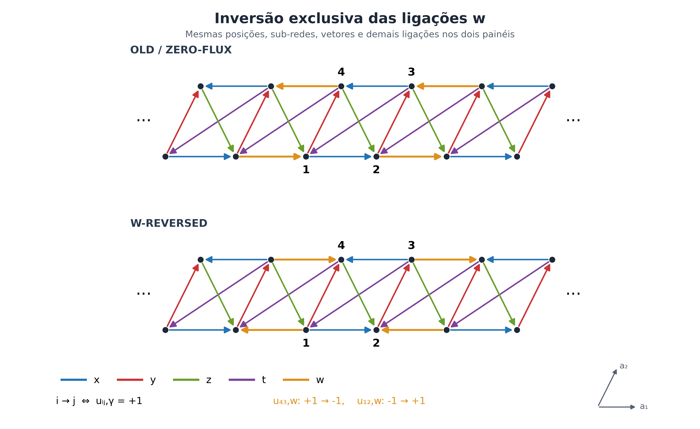
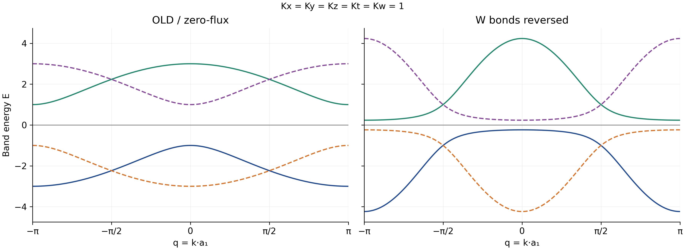
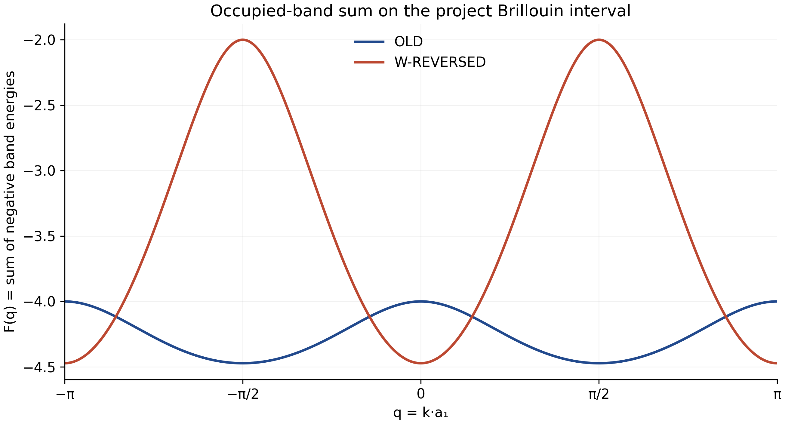
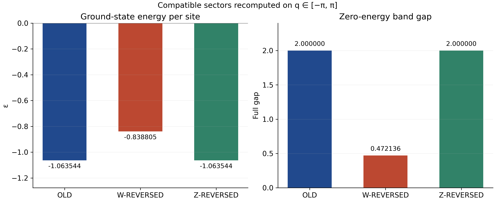

# Quadrupolar Spin Liquid in 1D — W-Reversed Gauge

Auditoria física, simbólica e numérica independente. Análise principal no ponto
isotrópico $K_x=K_y=K_z=K_t=K_w=1$, com unidades de energia dadas por esse acoplamento.
Data da execução e procedência estão nos arquivos JSON e no manifesto final.

**Convenção obrigatória em toda a análise: $q\in[-\pi,\pi]$.** O código fixa
`PROJECT_BZ = (-np.pi, np.pi)`. O período espectral menor é tratado como redundância,
com a contagem de estados explicitada na seção 19.

[RESULTADO NUMÉRICO] A inversão exclusiva de $w$ produz um setor de fluxo distinto.
No ponto isotrópico, OLD tem energia por sítio menor por **{{DELTA}}**.
A reconstrução do RAW, a mudança de base, o espectro real finito e a energia
foram verificados por caminhos independentes. O resultado vale para os setores
e acoplamentos comparados, sem alegar minimização sobre todos os gauges.

## 1. Original geometry and OLD / zero-flux sector

[DERIVADO DO PDF] A autoridade física é o PDF original, especialmente a geometria e
Eq.(11), nas páginas 3–4; figura OLD e definição de fluxo, página 4; Eq.(15) e
Fourier Eq.(16), página 5; agrupamento Eq.(17), páginas 6–7; Eq.(27) e Eq.(28),
página 8. O manuscrito foi inspecionado visualmente. Os scripts Z anteriores
serviram como arquitetura e regressão, sem definir o novo setor.

As posições internas são

$$
r_1=0,\quad r_2=a_1,\quad r_3=a_1+a_2,\quad r_4=a_2,
\qquad T=2a_1.
$$

Denota-se por $m_n$ a sub-rede $m$ na célula $n$. A tradução de célula $T$ e as
posições internas não são alteradas. No desenho pode-se escolher $a_1=(2,0)$ e
$a_2=(1,2)$; isso apenas estabelece a escala gráfica.

A convenção única para variáveis de gauge é

$$u_{ij,\gamma}=-u_{ji,\gamma},\qquad i\longrightarrow j\iff u_{ij,\gamma}=+1.$$

Os índices armazenados de um bond não precisam coincidir com a seta física:
se o valor armazenado é $-1$, a seta está invertida. Figura e Eq.(15) concordam
com todos os sinais OLD na tabela seguinte. Os oito produtos triangulares do
OLD são $+1$, conforme a convenção de fluxo orientado do próprio manuscrito.

## 2. Definition of the W-reversed configuration

[DERIVADO DO PDF] / [DEDUÇÃO MATEMÁTICA] A operação solicitada mantém a geometria
e muda somente $u_{43,w}:+1\to-1$ e $u_{12,w}:-1\to+1$.

{{GAUGE_TABLE}}

O código constrói W a partir de uma cópia de `ORIGINAL_GAUGE` e nega apenas
essas duas chaves. A verificação crítica usa `raise AssertionError`, permanecendo
ativa em `python -O`:

```python
changed_keys = {key for key in ORIGINAL_GAUGE
                if ORIGINAL_GAUGE[key] != W_REVERSED_GAUGE[key]}
if changed_keys != {"u43w", "u12w"}:
    raise AssertionError("Gauge contamination")
```

Verificam-se ainda $u_{34,x}=u_{42,z}=u_{31,z}=+1$ e todas as demais chaves.
Mutações deliberadas em ligações não-$w$ são rejeitadas pelo teste.

## 3. Bond-by-bond comparison OLD vs W

[DERIVADO DO PDF] A bond list é a entrada física do programa. `da1` e `da2`
medem o deslocamento final menos inicial em unidades de $a_1,a_2$; `cell_shift`
mede a diferença de células. Para cada ligação,

$$
d_1=2\,\mathrm{cell\_shift}+r_{j,1}-r_{i,1},\qquad
d_2=r_{j,2}-r_{i,2}.
$$

{{BOND_TABLE}}

O termo $z31$ da Eq.(11), escrito como $3(R+a_2-a_1),1(R)$, pode ser
transladado conjuntamente para $3_n,1_{n+1}$. O termo $t24$ equivale a
$2_n,4_{n+1}$. Essas traduções comuns preservam os deslocamentos.

[TESTE INDEPENDENTE] `draw_w_lattice.py` importa a geometria do módulo científico
e compara sua representação em células com uma transcrição independente do PDF.
Em `OLD_EDGES` e `W_REVERSED_EDGES`, somente arestas `kind == "w"` devem ter
os extremos trocados. O quadro visível contém {{EDGE_COUNT}} arestas, das quais
{{REVERSED_EDGE_COUNT}} setas $w$ foram invertidas; posições, vetores e demais
arestas são idênticos. Os dois painéis usam as mesmas coordenadas.



## 4. Plaquette fluxes

[DERIVADO DO PDF] O fluxo orientado adotado é

$$W_p=\prod_{(ij,\gamma)\in p}^{\mathrm{anti\!\!hor\acute ario}}u_{ij,\gamma},
\qquad W_p=e^{i\Phi_p}.$$

Cada percurso é fechado, tem área orientada positiva e é resolvido no grafo de
ligações transladadas. Um passo contrário à orientação armazenada fornece
$-u_{ij,\gamma}$. As células são explicitadas porque os nomes $W_{ijk}$ isolados
não distinguem todos os triângulos.

{{FLUX_TABLE}}

[DEDUÇÃO MATEMÁTICA] O produto foi calculado antes de aplicar o sanity check:
um ciclo que contém uma ligação $w$ recebe um fator $-1$, enquanto os ciclos
sem $w$ permanecem iguais. Os quatro fluxos do bloco $x$ são $+1$ em ambos;
os quatro do bloco $w$ passam de $+1$ a $-1$. Na convenção do manuscrito,
esses últimos passam de $\Phi=0$ a $\Phi=\pi$ módulo $2\pi$.

## 5. Gauge inequivalence/equivalence

[DEDUÇÃO MATEMÁTICA] Sob uma transformação local
$u_{ij}\mapsto s_i u_{ij}s_j$, com $s_i=\pm1$, cada fator de sítio aparece
duas vezes num ciclo fechado. Logo os fluxos são invariantes, inclusive para
transformações dependentes da célula. Como quatro fluxos diferem, OLD e W
não são gauge-equivalentes.

[TESTE INDEPENDENTE] A busca exaustiva de todas as $2^4=16$ matrizes
$G_s=\operatorname{diag}(s_1,s_2,s_3,s_4)$ encontra **zero soluções** entre
OLD e W. O teste de controle OLD versus OLD encontra as duas soluções globais.
Todos os oito fluxos também foram verificados sob as 16 transformações em cada
setor. Para gauges periódicos de quatro sub-redes, preservar $x12$ exige
$s_1s_2=+1$, enquanto inverter $w12$ exigiria $s_1s_2=-1$.

## 6. Real-space Hamiltonian

[DERIVADO DO PDF] Parte-se de

$$\widehat H=i\sum_\gamma\sum_{\langle ij\rangle_\gamma}
K_\gamma u_{ij,\gamma}\theta_i^y\theta_j^y.$$

Escrevendo $\theta_{mn}=\theta_m^y(n)$, a lista real dá

$$
\begin{aligned}
H_O=i\sum_n\{&K_x(\theta_{1n}\theta_{2n}+\theta_{3n}\theta_{4n})
+K_y(\theta_{2n}\theta_{3n}-\theta_{4n}\theta_{1n})\\
&+K_z(\theta_{4n}\theta_{2n}+\theta_{3n}\theta_{1,n+1})
+K_w(\theta_{4n}\theta_{3,n-1}-\theta_{1n}\theta_{2,n-1})\\
&-K_t(\theta_{1n}\theta_{3n}+\theta_{2n}\theta_{4,n+1})\},
\end{aligned}
$$

$$
\begin{aligned}
H_W=i\sum_n\{&K_x(\theta_{1n}\theta_{2n}+\theta_{3n}\theta_{4n})
+K_y(\theta_{2n}\theta_{3n}-\theta_{4n}\theta_{1n})\\
&+K_z(\theta_{4n}\theta_{2n}+\theta_{3n}\theta_{1,n+1})
+\underbrace{K_w(-\theta_{4n}\theta_{3,n-1}+\theta_{1n}\theta_{2,n-1})}_{\text{somente estes dois sinais mudam}}\\
&-K_t(\theta_{1n}\theta_{3n}+\theta_{2n}\theta_{4,n+1})\}.
\end{aligned}
$$

Portanto,

$$\boxed{\Delta H_W=2iK_w\sum_n
(\theta_{1n}\theta_{2,n-1}-\theta_{4n}\theta_{3,n-1}).}$$

## 7. Fourier transform

[DERIVADO DO PDF] Preserva-se a convenção da Eq.(16):

$$\theta_m^y(R)=\sqrt{\frac4N}\sum_{k\in\mathrm{BZ}/2}
\left[e^{ikR}\theta_m^y(k)+e^{-ikR}\theta_m^{y\dagger}(k)\right].$$

Define-se $q=q_1=k\cdot a_1$ e $q_2=k\cdot a_2$. Para um bond com extremos
$r_i,r_j$, os termos $\theta_i^\dagger\theta_j$ recebem
$e^{ik(r_j-r_i)}=e^{i(qd_1+q_2d_2)}$. A orientação oposta produz a conjugada,
com o sinal devido à anticomutação de Majoranas. Assim,

$$
(H_{\rm raw})_{ij}\mathrel{+}=iK_\gamma u_{ij,\gamma}e^{i(qd_1+q_2d_2)},
\quad (H_{\rm raw})_{ji}\mathrel{+}=[(H_{\rm raw})_{ij}]^*.
$$

Esta é a matriz com elementos na convenção $iK$ do manuscrito. A relação entre
esses elementos e frequências canônicas $2E$ é derivada na seção 19, sem copiar
um prefator de energia de um script antigo.

## 8. RAW Hamiltonian

[DEDUÇÃO MATEMÁTICA] Os dez bonds contribuem individualmente:

| Bond armazenado | Elemento preenchido | Contribuição OLD nesse elemento | Contribuição W |
|---|---|---|---|
| $12,x$ | $12$ | $iK_x e^{iq}$ | igual |
| $34,x$ | $34$ | $iK_x e^{-iq}$ | igual |
| $23,y$ | $23$ | $iK_y e^{iq_2}$ | igual |
| $41,y$ | $41$ | $-iK_y e^{-iq_2}$ | igual |
| $42,z$ | $42$ | $iK_z e^{i(q-q_2)}$ | igual |
| $31,z$ | $31$ | $iK_z e^{i(q-q_2)}$ | igual |
| $43,w$ | $43$ | $iK_w e^{-iq}$ | $-iK_w e^{-iq}$ |
| $12,w$ | $12$ | $-iK_w e^{-iq}$ | $+iK_w e^{-iq}$ |
| $13,t$ | $13$ | $-iK_t e^{i(q+q_2)}$ | igual |
| $24,t$ | $24$ | $-iK_t e^{i(q+q_2)}$ | igual |

Cada termo também preenche sua entrada conjugada. Após coletar os elementos
superiores, obtém-se independentemente da implementação:

| Coeficiente RAW | OLD | W-REVERSED |
|---|---|---|
| $f_{12}^{raw}$ | $i(K_xe^{iq}-K_we^{-iq})$ | $i(K_xe^{iq}+K_we^{-iq})$ |
| $f_{13}^{raw}$ | $-ie^{iq_2}(K_te^{iq}+K_ze^{-iq})$ | igual |
| $f_{14}^{raw}$ | $iK_y e^{iq_2}$ | igual |
| $f_{23}^{raw}$ | $iK_y e^{iq_2}$ | igual |
| $f_{24}^{raw}$ | $-ie^{iq_2}(K_te^{iq}+K_ze^{-iq})$ | igual |
| $f_{34}^{raw}$ | $i(K_xe^{-iq}-K_we^{iq})$ | $i(K_xe^{-iq}+K_we^{iq})$ |

Os fatores transversais superiores são **$e^{+iq_2}$**. Por exemplo, o bond
$31,z$ está armazenado com deslocamento $(+1,-1)$; seu conjugado no elemento
$13$ é $-iK_z e^{-iq+iq_2}$.

[TESTE INDEPENDENTE] Foram comparados `raw_from_bonds`, as fórmulas coletadas,
uma transcrição simbólica independente do PDF e os blocos de Fourier da cadeia
finita. O erro máximo RAW versus fórmula foi {{RAW_ERROR}}. O teste de fase
transversal ocorre antes de qualquer aplicação da Eq.(27).

## 9. Eq.(27)

[DERIVADO DO PDF] / [DEDUÇÃO MATEMÁTICA] Adota-se a substituição

$$
U(q_2)=\operatorname{diag}(1,1,e^{-iq_2},e^{-iq_2}),\qquad
\Theta_{raw}=U\Theta_{Bloch}.
$$

Logo $\Theta_{raw}^\dagger H_{raw}\Theta_{raw}
=\Theta_{Bloch}^\dagger U^\dagger H_{raw}U\Theta_{Bloch}$ e

$$\boxed{H_{Bloch}=U^\dagger H_{raw}U.}$$

$U^\dagger U=I$ é verificado simbolicamente. Em $13,14,23,24$, o fator à
direita $e^{-iq_2}$ cancela o $e^{+iq_2}$ RAW. Em $34$, os dois fatores se
cancelam entre si. Todos os elementos finais ficam independentes de $q_2$.

[TESTE INDEPENDENTE] Há um teste de mutação explícito: trocar $q_2\to-q_2$
no RAW e simultaneamente usar $UH_{raw}U^\dagger$ pode reproduzir o Bloch
final. O novo teste RAW rejeita esse par de erros, mesmo quando o teste final
passaria. Resíduos medidos:

{{MUTATION_TABLE}}

## 10. Final Bloch Hamiltonian

[RESULTADO SIMBÓLICO] Extraindo a matriz após a transformação, define-se

$$a=i(K_xe^{iq}+K_we^{-iq}),\quad
b=-i(K_te^{iq}+K_ze^{-iq}),\quad y=K_y.$$

Então

$$\boxed{
H_W(q)=\begin{pmatrix}
0&a&b&iy\\
a^*&0&iy&b\\
b^*&-iy&0&-a^*\\
-iy&b^*&-a&0
\end{pmatrix}.}$$

Foi demonstrado, sem assumir inicialmente, que $f_{23}=f_{14}$,
$f_{24}=f_{13}$ e $f_{34}=-f_{12}^*$. A Hermiticidade é exata para todos
os acoplamentos reais.

## 11. OLD vs W coefficient table

[DEDUÇÃO MATEMÁTICA] Os coeficientes resultantes da geometria são:

| Coeficiente | OLD auditado | W-REVERSED | Mudou diretamente? | Família física |
|---|---|---|---|---|
| $f_{12}$ | $i(K_xe^{iq}-K_we^{-iq})$ | $i(K_xe^{iq}+K_we^{-iq})$ | Sim | $x12,w12$ |
| $f_{13}$ | $-i(K_te^{iq}+K_ze^{-iq})$ | igual | Não | $t13,z31$ |
| $f_{14}$ | $iK_y$ | igual | Não | $y41$ |
| $f_{23}$ | $iK_y$ | igual | Não | $y23$ |
| $f_{24}$ | $-i(K_te^{iq}+K_ze^{-iq})$ | igual | Não | $t24,z42$ |
| $f_{34}$ | $i(K_xe^{-iq}-K_we^{iq})$ | $i(K_xe^{-iq}+K_we^{iq})$ | Sim | $x34,w43$ |

O teste de diferença, construído somente dos dois bonds $w$, dá

$$\Delta H(q)=2iK_w\begin{pmatrix}
0&e^{-iq}&0&0\\-e^{iq}&0&0&0\\
0&0&0&e^{iq}\\0&0&-e^{-iq}&0
\end{pmatrix}.$$

**Divergência documental preservada.** [DERIVADO DO PDF] A Eq.(26) literal,
na página 7, escreve $i(K_xe^{+iq}-K_we^{-iq})$ para $f_{34}$.
A referência OLD fornecida conserva essa expressão. A Eq.(11), os extremos
do bond $x34$ e o agrupamento da Eq.(17), na página 6, dão
$i(K_xe^{-iq}-K_we^{+iq})$. A diferença exata é

$$f_{34}^{geometria}-f_{34}^{(26),literal}=2(K_x+K_w)\sin q.$$

A Eq.(27) não pode resolver essa diferença porque age igualmente em 3 e 4.
A divergência foi localizada antes de prosseguir; aplica-se a hierarquia
geométrica explicitamente pedida. **Nenhum arquivo original foi corrigido.**
OLD neste relatório significa o gauge original com a matriz auditada da geometria.
Testar só $q=0$ ou $q=\pi$ ocultaria essa diferença.

Há ainda um sinal de fase incorreto na expansão intermediária de $y41$ da
página 6: aparece $-iK_y e^{+iq_2}\theta_4^\dagger\theta_1$.
O agrupamento na mesma página usa $e^{-iq_2}$, que concorda com a geometria
e a conjugação Hermitiana. A linha intermediária também é documentada, sem
ser usada como fonte isolada do RAW.

## 12. Symmetries

[RESULTADO SIMBÓLICO] Foram verificadas independentemente:

$$H(q)^\dagger=H(q),\qquad H(-q)=-H(q)^*,\qquad H(q+2\pi)=H(q).$$

Além disso,

$$H(q+\pi)=D_\pi H(q)D_\pi^\dagger,\qquad
D_\pi=\operatorname{diag}(1,-1,-1,1).$$

O espectro tem período $\pi$. Isso é uma redundância no intervalo principal
$[-\pi,\pi]$, e não uma autorização para encurtar os gráficos ou integrais.

O pareamento no mesmo $q$ é provado pela operação antiunitária $J\mathcal K$:

$$
JH(q)^*J^\dagger=-H(q),\qquad
J=\begin{pmatrix}0&0&-1&0\\0&0&0&-1\\1&0&0&0\\0&1&0&0\end{pmatrix},
\quad J^2=-I.
$$

Ela leva $E$ a $-E$; não implica degenerescência entre duas energias positivas.
As condições de degenerescência de mesmo sinal e fechamento em zero são
deduzidas a seguir, sem importar a degenerescência dupla de Z-REVERSED.

## 13. Characteristic polynomial

[RESULTADO SIMBÓLICO] Escreva $a=a_R+ia_I$, $b=b_R+ib_I$. Para W,

$$
a_R=(K_w-K_x)\sin q,\quad a_I=(K_x+K_w)\cos q,
\quad b_R=(K_t-K_z)\sin q,\quad b_I=-(K_t+K_z)\cos q.
$$

Para OLD, apenas $a_R=-(K_x+K_w)\sin q$ e $a_I=(K_x-K_w)\cos q$ diferem.
Defina

$$S=a_R^2+a_I^2+b_R^2+b_I^2+y^2,\qquad
R=a_I^2(b_R^2+b_I^2)+y^2b_I^2.$$

O cálculo simbólico direto de $\det(\lambda I-H)$ em cinco variáveis reais
independentes fornece

$$\boxed{P_W(\lambda,q)=\lambda^4-2S\lambda^2+S^2-4R.}$$

| Potência | $\lambda^4$ | $\lambda^3$ | $\lambda^2$ | $\lambda$ | $1$ |
|---|---:|---:|---|---:|---|
| Coeficiente | $1$ | $0$ | $-2S$ | $0$ | $S^2-4R$ |

O polinômio é par. O teste não apenas calcula esse determinante reduzido:
ele demonstra simbolicamente que a matriz derivada da bond list é igual à
matriz reduzida após a substituição das partes reais e imaginárias.

Em acoplamentos explícitos,

$$S_W=\sum_\gamma K_\gamma^2+2(K_tK_z+K_xK_w)\cos2q,$$

$$R_W=\cos^2q\left[(K_x+K_w)^2
(K_t^2+K_z^2+2K_tK_z\cos2q)+K_y^2(K_t+K_z)^2\right].$$

No OLD, $S_O=\sum K_\gamma^2+2(K_tK_z-K_xK_w)\cos2q$ e
$R_O=\cos^2q[(K_x-K_w)^2(K_t^2+K_z^2+2K_tK_z\cos2q)+K_y^2(K_t+K_z)^2]$.
Logo o espectro ordenado é

$$E=\{-\sqrt{S+2\sqrt R},-\sqrt{S-2\sqrt R},
\sqrt{S-2\sqrt R},\sqrt{S+2\sqrt R}\}.$$

A Hermiticidade implica $S\ge2\sqrt R$. Degenerescências de mesmo sinal
ocorrem quando $R=0$; fechamento em zero exige $S^2=4R$. Os autovalores
fechados são alvos de teste; todas as quantidades físicas numéricas usam `eigvalsh`.

## 14. Isotropic analytic limit

[RESULTADO SIMBÓLICO] Substituir os cinco acoplamentos unitários na matriz
derivada, com $c=\cos q$, resulta em

$$H_W(q)=i\begin{pmatrix}
0&2c&-2c&1\\-2c&0&1&-2c\\2c&-1&0&2c\\-1&2c&-2c&0
\end{pmatrix},$$

$$S_W=1+8c^2,\quad R_W=4c^2(1+4c^2),\quad
P_W=\lambda^4-2(1+8c^2)\lambda^2+1.$$

Em particular, $\det H_W=1$ para todo $q$. As energias positivas são

$$e_+=\sqrt{1+4c^2}+2|c|,\qquad
e_-=\sqrt{1+4c^2}-2|c|=\frac1{e_+}.$$

As quatro raízes $(-e_+,-e_-,e_-,e_+)$ são substituídas no determinante
para verificar a solução. Elas não foram codificadas como entrada do cálculo
de bandas. O espectro não é duplamente degenerado em um momento genérico.
Em $q=\pm\pi/2$, há duas energias $-1$ e duas $+1$.

O OLD obtido pelo mesmo procedimento dá

$$P_O=\lambda^4-10\lambda^2+25-16\cos^2q,\qquad
E_O=\{\pm\sqrt{5+4|\cos q|},\ \pm\sqrt{5-4|\cos q|}\}.$$

## 15. Special-momentum spectra

[RESULTADO SIMBÓLICO] Para W, os espectros exatos nos sete pontos pedidos são:

| $q$ | Espectro W ordenado |
|---|---|
| $-\pi$ | $(-2-\sqrt5,\ 2-\sqrt5,\ \sqrt5-2,\ 2+\sqrt5)$ |
| $-\pi/2$ | $(-1,-1,1,1)$ |
| $-\pi/4$ | $(-\sqrt3-\sqrt2,\ \sqrt2-\sqrt3,\ \sqrt3-\sqrt2,\ \sqrt3+\sqrt2)$ |
| $0$ | $(-2-\sqrt5,\ 2-\sqrt5,\ \sqrt5-2,\ 2+\sqrt5)$ |
| $\pi/4$ | $(-\sqrt3-\sqrt2,\ \sqrt2-\sqrt3,\ \sqrt3-\sqrt2,\ \sqrt3+\sqrt2)$ |
| $\pi/2$ | $(-1,-1,1,1)$ |
| $\pi$ | $(-2-\sqrt5,\ 2-\sqrt5,\ \sqrt5-2,\ 2+\sqrt5)$ |

[RESULTADO NUMÉRICO] Diagonalizações diretas:

{{SPECIAL_TABLE}}

O teste isotrópico independente cobre ainda 1001 pontos em $[-\pi,\pi]$;
seu erro máximo de espectro é {{ISOTROPIC_ERROR}}.

## 16. Band dispersions on [-pi,pi]

[RESULTADO NUMÉRICO] Ambos os painéis usam 2001 pontos, os mesmos limites
verticais, linha $E=0$, ticks em $-\pi,-\pi/2,0,\pi/2,\pi$ e 300 dpi.



Para visualização, `eigh` fornece autovetores. A cada passo são avaliadas as
24 permutações, maximizando $\sum_m|\langle u_m(q_i)|u_{p(m)}(q_{i+1})\rangle|^2$.
Em subespaços degenerados, a base é transportada por uma rotação unitária.
As cores são uma convenção visual nos cruzamentos. Em cada $q$, ordenar as
bandas rastreadas reproduz `eigvalsh`; erros máximos: {{TRACKING_ERRORS}}.
Tracking não entra na ocupação, no gap, em $F(q)$ ou na energia.

## 17. Gap analysis

[DEDUÇÃO MATEMÁTICA] São reportadas duas quantidades distintas:

$$\mathrm{min\_abs\_E}=\min_{q,n}|E_n(q)|,$$

$$\mathrm{zero\_energy\_band\_gap}
=\min_{E>0}E-\max_{E<0}E=2\,\mathrm{min\_abs\_E}$$

para o espectro pareado e gapped destes setores. Um fechamento é classificado
separadamente pela tolerância; resíduos brutos não são descartados nos JSON.

Como $e_-=1/e_+$, seu mínimo global W ocorre em $|\cos q|=1$:

$$\mathrm{min\_abs\_E}_W=\sqrt5-2,\qquad
\mathrm{zero\_energy\_band\_gap}_W=2\sqrt5-4.$$

Os pontos são $q=-\pi,0,\pi$. Em OLD, os valores correspondentes são $1$ e $2$.
O menor gap W não determina qual setor tem menor energia fundamental.

[TESTE INDEPENDENTE] A busca numérica inclui 16001 pontos, detecção de mínimos
locais, refinamento contínuo com `minimize_scalar` e as duas bordas. A prova
analítica isotrópica confirma o mínimo global; para acoplamentos arbitrários,
o algoritmo de busca numérica não é uma prova por aritmética intervalar.

{{GAP_TABLE}}

## 18. Occupied-band sum F(q)

[DEDUÇÃO MATEMÁTICA] A definição é

$$F_I(q)=\sum_{E_{I,n}(q)<0}E_{I,n}(q).$$

No limite isotrópico,

$$F_W(q)=-2\sqrt{1+4\cos^2q},$$

$$F_O(q)=-\sqrt{5+4\cos q}-\sqrt{5-4\cos q}.$$

Em ambos há duas bandas negativas para todo $q$. As mudanças de rótulo nos
cruzamentos não mudam essa soma. Estas funções isotrópicas são suaves porque
os radicandos são positivos; não se aplicou suavização. O código calcula a
soma negativa diretamente, preservando eventuais cúspides em outros acoplamentos.



## 19. Ground-state energy per site

[DERIVADO DO PDF] A Eq.(28), apresentada na página 8 como energia fundamental
**por sítio**, escreve $E_I^{(0)}=N^{-1}\sum_{n,k}E_{I,n}(k)\Theta[-E_{I,n}(k)]$.
Aqui $L=N_{cell}$ e $N=N_{site}=4L$. Usamos $\epsilon$ para essa densidade,
reservando $E_0(L)$ para a energia total finita.

[DEDUÇÃO MATEMÁTICA] A normalização é fixada pelo Hamiltoniano real, com
$\{\gamma_i,\gamma_j\}=2\delta_{ij}$:

$$\widehat H=\frac i4\gamma^T A\gamma,\quad A_{ij}=2K_\gamma u_{ij,\gamma},
\quad A_{ji}=-A_{ij},\quad h=\frac{iA}{2}.$$

Uma redução ortogonal de $A$ a blocos $\begin{psmallmatrix}0&\omega\\-\omega&0\end{psmallmatrix}$
dá $H_\alpha=\omega_\alpha(f_\alpha^\dagger f_\alpha-1/2)$.
Portanto,

$$E_0=-\frac12\sum_{\omega_\alpha>0}\omega_\alpha
=-\frac14\sum_j|\operatorname{eig}_j(iA)|
=\sum_{E_j(h)<0}E_j(h).$$

Um bond isolado $iK\gamma_1\gamma_2$ tem energia mínima $-|K|$, confirmando
o fator. Como as bandas de $h$ são metade das frequências canônicas, acrescentar
outro fator $1/2$ à sua soma negativa seria incorreto.

[TESTE INDEPENDENTE] Cada uma das cinco famílias foi também isolada, com
$K_\gamma=-1.7$ e os outros acoplamentos nulos, em OLD e W. São dois dímeros
por célula, portanto $\epsilon=-|K_\gamma|/2=-0.85$. Tanto a cadeia real de
cinco células quanto a integral em $[-\pi,\pi]$ reproduzem esse valor exato
nos dez testes, fixando a escala absoluta independentemente das fórmulas finais.

Na Fourier literal, $\sqrt{4/N}=1/\sqrt L$. Sob a normalização real acima,
os operadores $\theta(k)$ têm anticomutador com seu conjugado igual a $2$;
os operadores canônicos em momentos genéricos são $f(k)=\theta(k)/\sqrt2$.
Escrever apenas um representante de cada par $(k,-k)$ produz a matriz $2h$
na forma canônica. Completar a BZ restitui $\sum F(q)$ com a matriz $h$.
Pontos auto-conjugados requerem blocos de Majoranas próprios; a diagonalização
finita de $A$ os inclui automaticamente. BZ/2 aqui se refere à redundância de
conjugação de Majoranas, distinta da covariância geométrica $q\mapsto q+\pi$.

Para a célula $T=2a_1$, os $L$ momentos independentes satisfazem
$e^{2iLq}=1$: $q_\ell=\pi\ell/L$, escolhendo $L$ representantes. Logo

$$\epsilon_L=\frac1{4L}\sum_{\ell=1}^{L}F(q_\ell).$$

O intervalo principal solicitado tem largura $2\pi$ e contém dois períodos
espectrais. Cada representante repetido recebe metade do peso; não se criam
estados adicionais. Assim, na zona pedida,

$$\boxed{\epsilon=\frac{E_0}{N_{site}}
=\frac1{8\pi}\int_{-\pi}^{\pi}F(q)\,dq.}$$

Usar $1/(4\pi)$ nessa mesma integral duplicaria a energia. A comparação
com $E_0(L)/(4L)$ exclui os fatores indevidos 2 e 4 sem depender da notação
do manuscrito para a soma na meia BZ.

Definindo a integral elíptica completa de segunda espécie pelo **parâmetro**
$m$, $\mathbb E(m)=\int_0^{\pi/2}\sqrt{1-m\sin^2t}\,dt$, obtém-se

$$\epsilon_W=-\frac{\sqrt5}{\pi}\mathbb E(4/5),\qquad
\epsilon_O=-\frac3\pi\mathbb E(8/9).$$

A primeira segue de $1+4\cos^2q=5[1-(4/5)\sin^2q]$; para OLD,
$5\pm4\cos q=1+8\{\cos^2(q/2),\sin^2(q/2)\}$.
As avaliações de `scipy.special.ellipe` são verificações adicionais,
independentes da quadratura dos autovalores.

{{ENERGY_TABLE}}

## 20. Numerical convergence

[RESULTADO NUMÉRICO] A regra trapezoidal foi aplicada em seis malhas aninhadas,
sempre de $-\pi$ a $\pi$, com as duas bordas incluídas e pesadas corretamente:

{{CONVERGENCE_TABLE}}

Não se inferem casas estáveis pela formatação da tabela. Diferenças absolutas
entre malhas consecutivas e comparação com a quadratura adaptativa:

{{UNCERTAINTY_TABLE}}

Uma quadratura `quad` independente avalia novos `eigvalsh` e divide o intervalo
nos pontos de simetria e em possíveis cúspides detectadas. Ela é repetida com
tolerâncias mais estritas. A incerteza empírica conservadora por setor é o
máximo entre $10^{-11}$, duas vezes as duas últimas diferenças de malha,
duas vezes a diferença malha/quadratura, dez vezes o erro estimado de `quad`
e duas vezes a diferença das quadraturas repetidas.

A tolerância efetiva de decisão é o máximo entre $10^{-10}$ e a soma das
incertezas dos dois setores. Aqui é **{{ENERGY_TOL}}**, muito menor que
$\Delta\epsilon={{DELTA}}$. Esta é uma estimativa numérica conservadora,
não uma cota rigorosa de arredondamento. As identidades elípticas e o teste
finito fornecem verificações adicionais à convergência de malha.

## 21. Finite-chain independent validation

[TESTE INDEPENDENTE] `finite_majorana_A` constrói a matriz real antissimétrica
diretamente dos bonds, com condições periódicas e sem usar os coeficientes
fechados. Para $L=5,8,17$, foram usadas duas escolhas assimétricas, uma delas
com sinais mistos. A matriz de Fourier é construída das coordenadas reais:

$$V_{(n,m),m'}(q,q_2)=\frac{\delta_{mm'}}{\sqrt L}
e^{i[q(2n+r_{m,1})+q_2r_{m,2}]}.$$

Foram verificados $V_q^\dagger(iA/2)V_q=H_{raw}(q,q_2)$, o caso Bloch
com $q_2=0$, completude da união dos $L$ blocos e

$$\operatorname{spec}(iA)=\bigcup_{q\ {
m independentes}}2\operatorname{spec}H(q).$$

O fator 2 dessa igualdade é essencial: comparar diretamente $iA$ com as
bandas $H$ seria uma convenção diferente. O erro máximo de espectro completo
nos testes assimétricos é {{FINITE_CORE_ERROR}}.

No ponto isotrópico, os tamanhos $5,8,17,33,65,129$ foram diagonalizados
também no espaço real completo. A convergência pedida é:

{{FINITE_TABLE}}

O maior erro espectral real/Bloch isotrópico é {{FINITE_COMPARE_ERROR}}.
As energias finitas são computadas por $-\operatorname{Tr}|iA|/4$, divididas
por $4L$, e comparadas à soma discreta de bandas e ao bulk. Os resíduos
finitos são separados da incerteza da quadratura termodinâmica.

[HIPÓTESE / AINDA NÃO PROVADO] A energia finita acima é a energia do Hamiltoniano
de matéria no gauge fixado. Uma projeção adicional no espaço físico de spins
pode impor paridade global e alterar a energia de uma cadeia finita por uma
excitação. Essa projeção não foi implementada; uma correção finita de paridade
não altera a densidade de energia no limite termodinâmico.

## 22. Randomized adversarial tests

[TESTE INDEPENDENTE] Seed fixa {{SEED}}; 1000 casos, com ambos OLD e W em cada
caso. As magnitudes dos cinco acoplamentos são sorteadas em $[0.15,2]$, com
separação mínima maior que $0.025$; 500 casos contêm obrigatoriamente ambos
os sinais. $q,q_2$ são sorteados em $[-\pi,\pi]$. A seed não foi escolhida
por desempenho. Uma transcrição simbólica independente acrescenta 64 casos
por setor em outro conjunto de acoplamentos.

{{VALIDATION_TABLE}}

O polinômio é comparado tanto com `np.poly(H)` como com
$\det(\lambda I-H)$ em valores independentes de $\lambda$. Os testes
numéricos físicos usam `np.linalg.eigvalsh`. As verificações de gauge e
fluxo permanecem ativas sob `python -O`. O teste `only_w_matrix_difference`
constrói sua previsão exclusivamente dos dois bonds $w$.

A regressão OLD reproduz a energia e os cinco espectros especiais já auditados.
O arquivo legado é usado somente como alvo de regressão, com sua origem e hash
registrados; W não reutiliza números ou CSV anteriores.

## 23. Performance benchmark

[RESULTADO NUMÉRICO] Cada operação recebeu warm-up e cinco medições com
`time.perf_counter()`. Tempos em segundos; bandas físicas incluem construção
de $H$ e `eigvalsh`. O benchmark distingue a integral com bandas já disponíveis
da avaliação completa da energia. A cadeia finita inclui montagem de $A$ e
diagonalização completa de $iA$. Nenhuma precisão foi reduzida.

{{BENCHMARK_TABLE}}

{{BENCHMARK_ENV}}

As medições são locais a esta máquina e não constituem uma garantia de tempo
em outro equipamento. Os cinco tempos brutos de cada linha estão no JSON.

## 24. Comparison with OLD / zero-flux

{{SUMMARY_TABLE}}

[RESULTADO NUMÉRICO] $\Delta\epsilon=\epsilon_W-\epsilon_O={{DELTA}}>0$.
**Setor favorecido: OLD / zero-flux**, entre os dois setores no ponto isotrópico.
A decisão usa energia com incerteza; o menor gap W não é o critério.

## 25. Consolidated comparison with previous sectors

[RESULTADO NUMÉRICO] Foram fornecidos scripts e resultados auditados de
Z-REVERSED. Para a comparação final, Z foi reconstruído como OLD com apenas
$u_{42,z},u_{31,z}$ invertidos e recalculado em $[-\pi,\pi]$, com o mesmo
prefator $1/(8\pi)$, quadratura e teste real finito. Seus resultados legados
não possuíam hashes originais dos scripts; servem somente como regressão.
Os números exibidos abaixo são da nova execução, com hashes atuais.

{{CONSOLIDATED_TABLE}}



OLD e Z são indistinguíveis em energia no limite numérico desta comparação
isotrópica, e ambos estão abaixo de W. O padrão de fluxos segue a ordem
$W124,W234,W123,W134,W213,W143,W214,W243$.
Upper-horizontal reversed foi omitido por não haver nesta auditoria um conjunto
numérico validado e compatível desse setor. Nenhum valor foi inferido ou copiado
de uma convenção não verificada.

## 26. Physical interpretation

[DEDUÇÃO MATEMÁTICA] A operação modifica fluxos locais, portanto representa
outro setor físico de gauge, embora a conectividade, a célula e os acoplamentos
sejam os mesmos. No ponto isotrópico, W permanece gapped, com bandas positivas
distintas na maior parte da zona e degenerescências em $\pm\pi/2$.
O espectro inteiro, ponderado pela ocupação, torna sua energia por sítio maior.

Essa comparação não estabelece sozinha uma classificação topológica, um
invariante de borda, uma transição de fase ou a estabilidade entre todas as
configurações não periódicas de gauge. Ela responde precisamente à inversão
exclusiva da família $w$ solicitada.

## 27. What is proven

Foram demonstrados simbolicamente a cadeia geometria → RAW → Eq.(27) → Bloch,
os seis coeficientes, a localização da divergência Eq.(26), as simetrias, o
polinômio par e as raízes isotrópicas. O gap isotrópico tem mínimo global
analítico. A inequivalência de gauge decorre dos produtos em ciclos fechados.

Foram confirmados numericamente os espectros independentes, os 1000 casos,
as cadeias finitas, os fatores de energia e as integrais em $[-\pi,\pi]$.
Os controles de procedência e a execução com warnings como erros acompanham
os resultados; não são substitutos para essas provas físicas.

## 28. What remains open

[HIPÓTESE / AINDA NÃO PROVADO] Permanecem fora do resultado demonstrado:
minimização sobre todos os setores de gauge, classificação topológica e
estados de borda, ordenação energética universal em acoplamentos anisotrópicos,
e projeção de paridade física nas cadeias finitas. Os testes aleatórios
verificam a implementação geral, sem provar essas propriedades globais.

A Eq.(26) literal e a fase da linha intermediária de $y41$ devem ser levadas
ao orientador como discrepâncias documentadas. A derivação geométrica resolve
qual expressão foi usada nesta auditoria; não reescreve retrospectivamente o PDF.

O caminho originalmente indicado para `Quadrupolar_Spin_Liquid_Z_Reversed(1).md`
não existia. Foi encontrada a versão `Quadrupolar_Spin_Liquid_Z_Reversed_Obsidian.md`;
o cálculo W depende do PDF e OLD, e os artefatos Z foram usados apenas na regressão
e comparação final. Isso está registrado nos metadados.

## 29. Final verdict

**Physical verdict — YES.** A geometria W-REVERSED foi implementada com somente
as duas variáveis $w$ invertidas, e apenas as setas correspondentes mudaram.

**Mathematical verdict — YES.** A derivação do Hamiltoniano real, RAW,
Eq.(27) e Bloch foi testada por transcrição independente e Fourier da cadeia finita.

**Numerical verdict — YES, para o ponto isotrópico reportado.** As malhas,
quadratura, fórmulas elípticas e cadeia finita concordam. A precisão reportada
respeita a incerteza estimada; dados em ponto flutuante não constituem provas
universais para todos os acoplamentos.

**Ground-state comparison:** $\epsilon_O={{EPSILON_OLD}}$,
$\epsilon_W={{EPSILON_W}}$, $\Delta\epsilon={{DELTA}}$.
Tolerância efetiva: {{ENERGY_TOL}}. Favorecido: **OLD**.

**Safety for advisor discussion — YES, WITH RESERVATIONS.** É seguro apresentar
os resultados como comparação isotrópica entre esses gauges, junto da
discrepância explícita da Eq.(26), da normalização demonstrada e dos limites
descritos na seção 28.

**FINAL SCIENTIFIC VERDICT: A.** Rubrica definida neste relatório, pois as letras
não vieram definidas no pedido: A = cadeia científica e testes requeridos
aprovados dentro do escopo declarado; B = pendência numérica; C = ambiguidade
física não resolvida; D = falha detectada; E = execução incompleta.

**Reprodução e proteção contra resultados stale.** Execute, na pasta dos
entregáveis, os comandos registrados em `README_W_REVERSED.md`. O builder
recusa qualquer mismatch dos hashes dos scripts, fontes locais e CSV/JSON.
O manifesto do relatório inclui ainda SHA-256 de todos os entregáveis.

{{HASH_TABLE}}

{{SOURCE_TABLE}}

As tabelas acima são montadas dos resultados executados. O snapshot OLD em
`sources/OLD_reference_unchanged.md` conserva exatamente os bytes fornecidos.
As fontes originais permanecem intactas. Os anexos `geometry_audit_notes.md`
e `algebra_audit_notes.md` conservam os registros das verificações independentes;
todas as contas necessárias ao resultado estão reproduzidas neste relatório.
